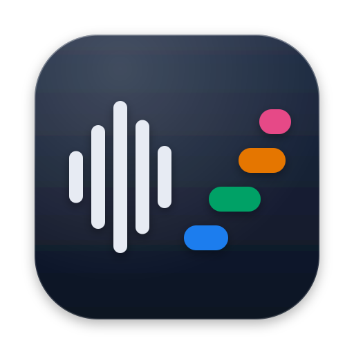
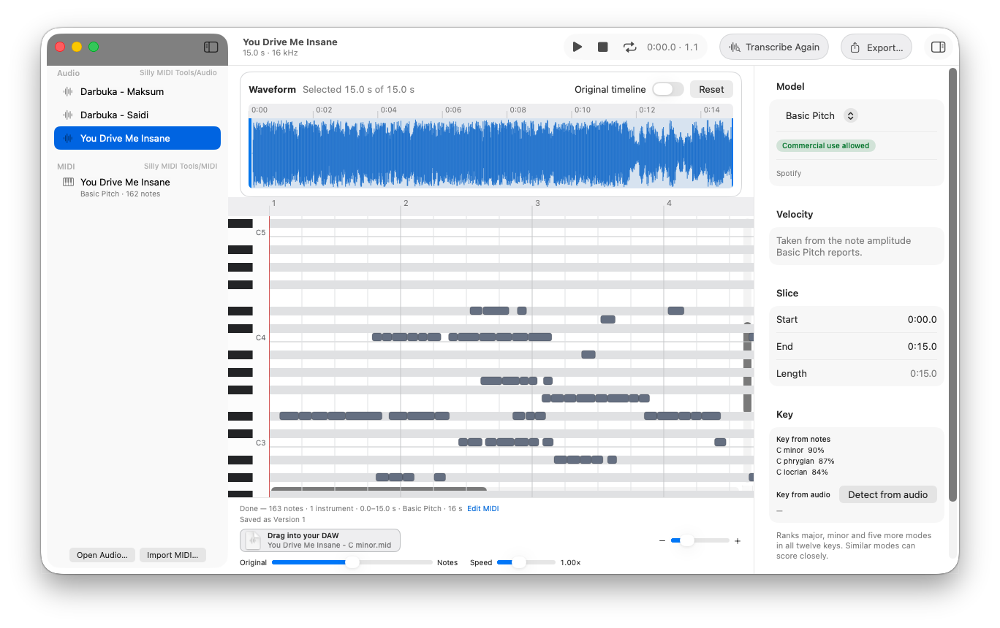
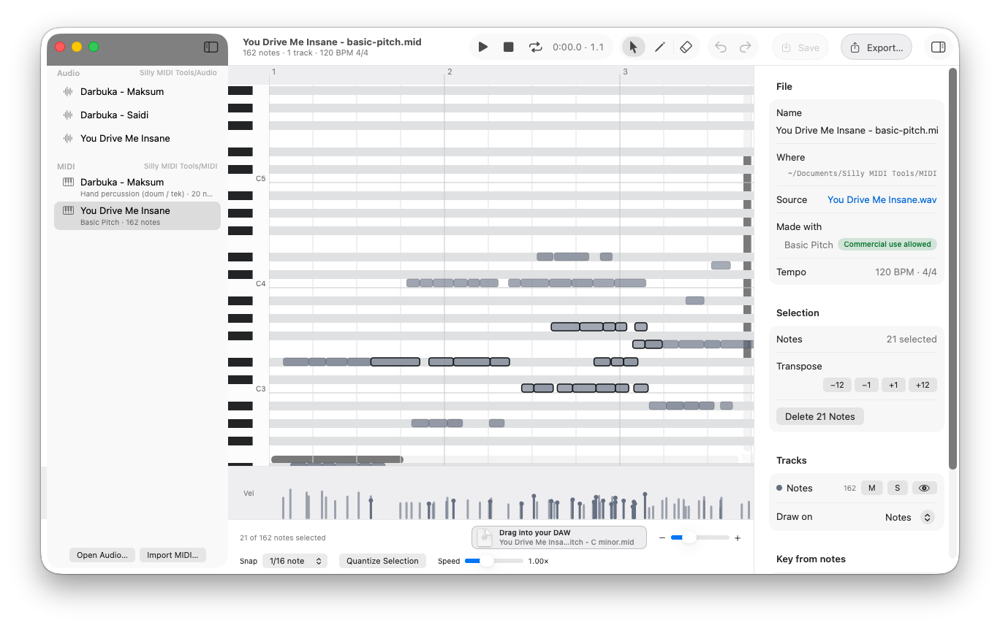
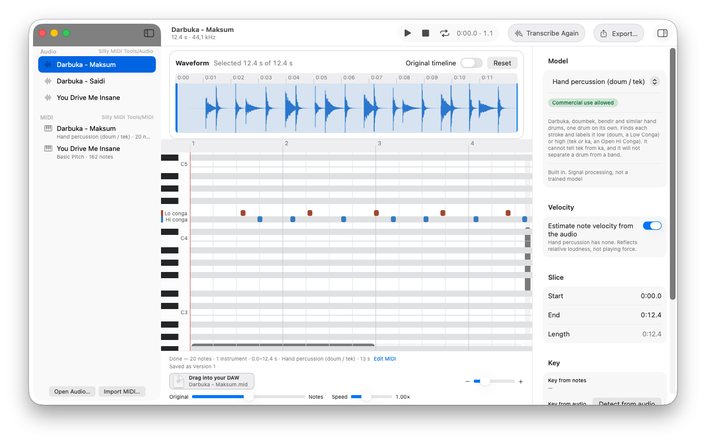

<p align="center">
  
</p>

<h1 align="center">Silly MIDI Tools</h1>

<p align="center">
  <strong>Sound in, notes out.</strong><br>
  Turn a recording into MIDI on your Mac, fix the notes, and drag them into your DAW.
</p>

<p align="center">
  <a href="https://github.com/Sillybit-io/silly-midi-tools/releases/latest"><strong>Download for Mac</strong></a><br>
  <sub>Free and open source · macOS 26 or later · Apple silicon</sub>
</p>

<p align="center">
  
</p>

## Why it exists

Silly MIDI Tools started with a song. Ableton's Convert to MIDI never got its parts right: every attempt came back with lots of extra notes to clean up.

So Sillybit built a converter where you pick a model made for what you recorded. A drum loop goes to a drum model, and a piano take goes to the piano model. That choice is what made the difference, especially for drums and percussion. On an M3 MacBook, the largest model, MuScriptor Large, transcribes a 4-minute song in about 50 seconds.

Everything runs on your Mac. Your audio is never uploaded anywhere.

## How it compares with Ableton Live and FL Studio

Both DAWs can turn audio into MIDI too. Live 12 Standard and Suite have three modes: Convert Melody, Convert Harmony and Convert Drums. FL Studio has Edison's Convert to score (Producer Edition and up) and the Newtone pitch editor (Signature Bundle and up).

| | Silly MIDI Tools | Ableton Live | FL Studio |
| --- | --- | --- | --- |
| Price | Free | Included in Live 12 Standard and Suite | Included in Producer Edition and up |
| How it listens | Six models, one for each kind of recording | Three modes: melody, harmony and drums | Pitch detection: Edison slices the audio and finds a pitch for each slice |
| A full band | MuScriptor writes one track per instrument | Works best on one isolated instrument (Suite can split stems first) | Notes go to one channel's piano roll (stems can be split first) |
| Drums | Five or eight kit pieces | Kick, snare and hi-hat | No drum mode |
| Hand drums | A detector for darbuka and similar drums | No dedicated mode | No dedicated mode |
| Tempo | Fixed 120 BPM, 4/4 grid | Your Live set's tempo | Your project's tempo |
| Where it runs | A separate app for Apple silicon Macs that works with any DAW | Inside Live, on Mac and Windows | Inside FL Studio, on Mac and Windows |

Your DAW is the better pick when the MIDI has to follow your project's tempo, when you're on Windows, or when you're releasing the music and the part would need MuScriptor or ADTOF, which are non-commercial only. Silly MIDI Tools is worth trying when your DAW's conversion gives you extra notes, especially on a full mix, a drum kit, or a hand drum.

<sub>Ableton details come from the [Live 12 manual](https://www.ableton.com/en/live-manual/12/converting-audio-to-midi/) and the [Live edition comparison](https://www.ableton.com/en/live/compare-editions/). FL Studio details come from the [Edison](https://www.image-line.com/fl-studio-learning/fl-studio-online-manual/html/plugins/Edison_3.htm) and [Newtone](https://www.image-line.com/fl-studio-learning/fl-studio-online-manual/html/plugins/Newtone.htm) manual pages and the [FL Studio edition comparison](https://www.image-line.com/fl-studio/compare-editions). Ableton and Live are trademarks of Ableton AG, and FL Studio is a trademark of Image-Line. Silly MIDI Tools isn't affiliated with either.</sub>

## How it works

1. Drop in a recording: WAV, MP3, FLAC, M4A or AIFF. Drag the handles if you only need part of it.
2. Pick a model and press Transcribe. With MuScriptor, notes show up on the piano roll while it's still listening.
3. Play the notes next to the original, fix the wrong ones in the editor, and drag the MIDI onto a track in your DAW.

Every run is saved as its own version, so you can try two models on the same clip and keep the better one. Your edits are never overwritten.

<p align="center">
  
</p>

## Pick a model for what you recorded

| You recorded | Model | Download |
| --- | --- | --- |
| A full song or band | MuScriptor (small, medium or large) | 209 MB to 2.74 GB |
| Anything with pitch, when you want it fast | Basic Pitch | Built in |
| Piano | Piano | 154 MB |
| Drums in a full mix | Drums (ADTOF) | 2 MB |
| Drum stems, e-kits and loops | Drums (OaF) | 6 MB |
| A darbuka or another hand drum, on its own | Hand percussion | Built in |

Models download the first time you use them. MuScriptor also needs a free Hugging Face account, and the app shows you what to do.

**Releasing your music?** MuScriptor and Drums (ADTOF) are for non-commercial use only, and that covers the MIDI they make. The other models allow commercial use; the piano model asks for a credit.

<p align="center">
  
</p>

## What else it does

- Plays the notes through a General MIDI sound bank next to the original, with a mix slider, 0.5x to 2x speed, and looping.
- Detects the key and can add it to the file name, like `Song - Eb minor.mid`.
- Exports Type 1 MIDI with one track per instrument.
- Imports your own MIDI files so you can edit them too.
- Keeps everything in one folder you choose, with `Audio` and `MIDI` inside.

## Install

1. Download the `.zip` from the [latest release](https://github.com/Sillybit-io/silly-midi-tools/releases/latest) and double-click it to unzip. Don't use the `unzip` command in Terminal, because it strips data the app needs.
2. Drag **SillyMIDITools.app** into your Applications folder.
3. The app isn't notarized by Apple yet, so macOS blocks the first launch. Run this once in Terminal:

   ```sh
   xattr -dr com.apple.quarantine /Applications/SillyMIDITools.app
   ```

   Or try to open the app, then go to System Settings › Privacy & Security and click **Open Anyway**.
4. Open the app and choose a folder for your files.

You need macOS 26 or later on a Mac with Apple silicon (M1 or newer). On an Intel Mac, you can [build it from source](docs/DEVELOPMENT.md#build-from-source).

## Good to know

- MIDI uses a fixed 120 BPM, 4/4 grid for now, so you can't change the tempo or time signature yet.
- Recordings can be up to an hour long. OGG files aren't supported.
- Velocity from MuScriptor, ADTOF and Hand percussion is estimated from loudness.

The [user guide](docs/GUIDE.md#known-limits) has the full list.

## Learn more

- [User guide](docs/GUIDE.md): the editor, versions, keyboard shortcuts and troubleshooting
- [Models](docs/MODELS.md): every model, its licence and how downloads work
- [Development](docs/DEVELOPMENT.md): build from source, run the tests, add a model, make a release

## Licence

Silly MIDI Tools is made by [Sillybit](https://github.com/Sillybit-io) and is free and open source under the [Apache License 2.0](LICENSE). The models and other third-party parts have their own licences, listed in [THIRD_PARTY_NOTICES.md](THIRD_PARTY_NOTICES.md).

<sub>The screenshots use "You Drive Me Insane" by Jon Worthy and the Bends ([CC BY 4.0](https://creativecommons.org/licenses/by/4.0/), from the [Free Music Archive](https://freemusicarchive.org/music/Jon_Worthy_and_the_Bends/Only_A_Dream/You_Drive_Me_Insane/)) and the darbuka recording "Maksum Ejemplo" by Derbake ([CC BY-SA 4.0](https://creativecommons.org/licenses/by-sa/4.0/), from [Wikimedia Commons](https://commons.wikimedia.org/wiki/File:Maksum_Ejemplo.ogg)).</sub>
