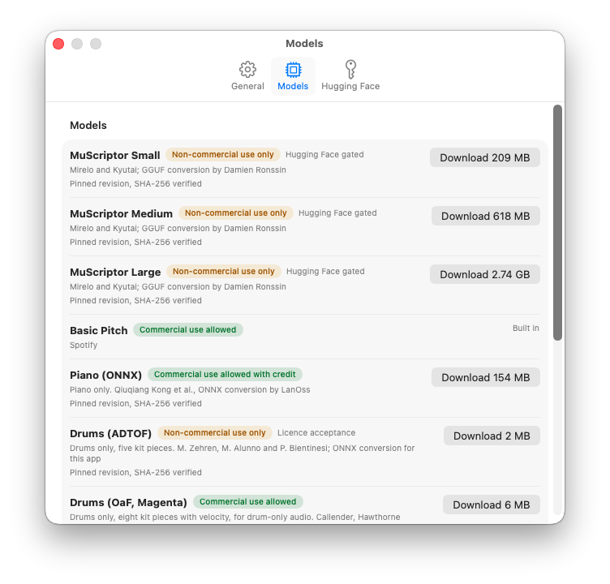

# Models

Silly MIDI Tools comes with two models built in and downloads the others the first time you use them. For a quick overview of which model to pick, see the [README](../README.md#pick-a-model-for-what-you-recorded).

| Model | Licence | Download | Use |
| --- | --- | --- | --- |
| MuScriptor small, medium, large (Mirelo and Kyutai; GGUF conversion by Damien Ronssin) | CC BY-NC 4.0 | 0.2 to 2.7 GB | Non-commercial use only |
| Piano (ONNX) (Kong et al., ONNX conversion by LanOss) | CC BY 4.0 | 154 MB | Piano only. Commercial use allowed with credit |
| Drums (ADTOF) (Zehren, Alunno and Bientinesi; ONNX conversion for this app) | CC BY-NC-SA 4.0 | 2 MB | Drums only, five kit pieces. Non-commercial use only |
| Drums (OaF, Magenta) (Callender, Hawthorne and Engel; ONNX conversion for this app) | Apache-2.0 | 6 MB | Drums only, eight kit pieces with velocity, for drum-only audio. Commercial use allowed |
| Drum separator (HT-Demucs) (Meta; ONNX export by StemSplit.io) | MIT | 316 MB | Optional helper for **Separate drums first**. Commercial use allowed |
| Hand percussion (this app) | Apache-2.0 | Built in | Darbuka and similar hand drums, one drum on its own. Low and high strokes only. Commercial use allowed |
| Basic Pitch (Spotify) | Apache-2.0 | Built in | Commercial use allowed |

Settings, Models lists every model with its licence and download size:

  

## Downloading

Basic Pitch is selected on a fresh install. The model picker shows each model's licence. Pick another model in the inspector and the button reads **Download & Transcribe**; the download happens when you press it, then the run starts. A failed or offline download shows a message with **Try Again**, and nothing is changed.

Downloads are pinned to a fixed revision and checked against a SHA-256 before use. Models are stored in the app's sandbox container under Application Support. Settings, Models shows each model's licence, lets you download or delete it, and can reveal the folder. **Manage Models…** in the model picker opens it.

## Memory

A model is loaded for each run and released when the run ends, so nothing stays in memory between transcriptions. When a model would need more than 40 percent of the Mac's memory while it runs (MuScriptor Large needs about 4.2 GB), the inspector says so under the picker, before anything is downloaded.

## MuScriptor and Hugging Face

MuScriptor weights are gated on Hugging Face. The first time you use one, an alert tells you its size and takes you to the licence sheet. You need a Hugging Face account, you must accept the terms on the model page, and you paste a read token (Settings, Hugging Face, or in the sheet) before the download starts. **Save and check** shows a progress line while it asks Hugging Face, says plainly if the token is rejected (and doesn't keep it) and shows the account when it is accepted. The download button then needs the three statements ticked. The piano model is not gated.

## How a model asks for access

Every downloadable model follows the same path. Each catalogue entry says what it needs before its first download: nothing (**open**), a licence sheet with the model's own statements (**terms**, used by ADTOF), or the licence sheet plus a Hugging Face token whose account accepted the authors' terms (**Hugging Face gated**, used by MuScriptor). The sheet ticks come from the entry, and Settings, Models labels each row.

To add a model to the catalogue, see [Development](DEVELOPMENT.md#adding-a-model).
