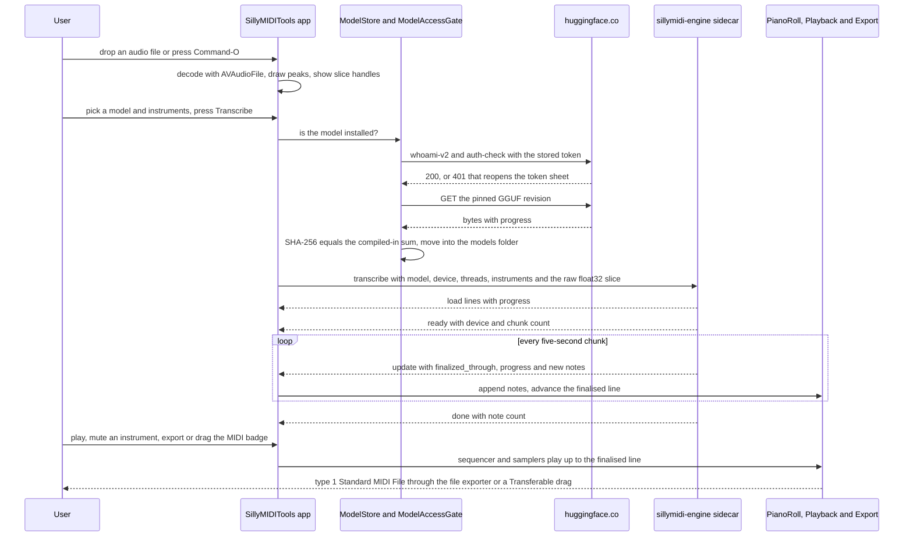

<!-- markdownlint-disable-next-line MD025 -->
# Silly MIDI Tools, a native macOS audio-to-MIDI app with MuScriptor and Basic Pitch engines

## TL;DR

- Effort: L — a new SwiftUI app, a C++ sidecar around muscriptor.cpp, a Swift port of Basic Pitch's post-processing on top of its Core ML model, a model store with Hugging Face gating, playback, export, and licence UI.
- Risk: medium — the engine's Intel build is untested upstream, the Basic Pitch note-extraction port must match the Python reference, and Metal plus the large model can only be verified on the owner's M3 Pro.
- Decisions made: native SwiftUI macOS app named Silly MIDI Tools with bundle id `io.sillybit.sillymiditools` and Xcode target `SillyMIDITools`; non-commercial use only; native ggml sidecar `sillymidi-engine` for MuScriptor; Basic Pitch via Core ML in-process, listed in the same picker with a commercial-use badge; audio slice with start and end handles; a Hugging Face token with accepted terms required for all three MuScriptor sizes; host-architecture builds only with ad-hoc signing; every commit straight to `main`; an XcodeGen project on Swift 6 language mode, Observation, Swift Testing and SwiftUI Transferable drag and drop, with the floor set at macOS 26 and Xcode 26 because the owner said support starts at Xcode 26 and wants newer macOS and SwiftUI technology used; CI on `macos-26`; App Sandbox from day one; GGUF weights pinned to revision `d7045f94e8b19427f4ff9542975035e66596e51c` with compiled-in SHA-256; Apple's bundled General MIDI soundbank driven by AVAudioSequencer for playback; fixed 120 bpm export; the installed agent-skill folders committed with the code; all from the owner's answers or recorded as defaults under Questions.
- Owner decisions pending: none — the owner chose Apache-2.0 for the app code.
- Cut from scope: universal binary and lipo merge, Developer ID signing and notarisation, the Python reference engine, sheet music, beat-grid quantisation, OGG decoding, Windows and Vulkan, a generic engine plugin system, feature branches and pull requests for v1, a nightly model-download CI job.
- Branch: `main` — the owner chose direct commits to `main` for the first release; the repository is empty and states no convention, so no `type/slug` branch is created.

## Scope

### Affected users

Musicians and producers on macOS 26 or later who drop a song or a stem into the app and get an editable MIDI file, with notes appearing live in a piano roll and playing back against the original. The owner tests on an Apple Silicon M3 Pro; the builder works on an Intel Mac with no GPU, so the small MuScriptor model and Basic Pitch are the development path and Metal plus the large model are validated by the owner.

### Ideal state

The repository holds Silly MIDI Tools, a SwiftUI app generated by XcodeGen, a CMake sidecar named sillymidi-engine that wraps muscriptor.cpp and speaks newline-delimited JSON, and a Core ML Basic Pitch engine. A user drops an audio file, trims it with two handles, picks a model, optionally picks instruments, and watches notes fill a piano roll while a progress bar runs. They can play the result against the original, then save or drag out a type 1 Standard MIDI File with one track per instrument. Every model shows its licence before download and on export, MuScriptor downloads require a Hugging Face token whose owner has accepted the authors' terms, and an About window lists every third-party component.

### IS / GAP ledger

| Gap | IS today (evidence) | GAP |
| --- | --- | --- |
| G1 | `skills-lock.json:1` is the only non-tooling file in the checkout and the GitHub repository is empty (baseline); XcodeGen 2.46.0 documents `legacy` external-build targets and `entitlements` plists (C52) | No Xcode project, no engine build integration, no LICENSE, README or notices, no git history |
| G2 | muscriptor.cpp exposes `Transcriber::load`, `transcribe` with a per-chunk callback and `availableDevices` as a C++23 static library (C2, C4, C6); its Intel build is untested (C9) | No process a Swift app can launch; no newline-delimited JSON protocol; Intel build unproven |
| G3 | AVAudioFile opens files as deinterleaved float and AVAudioConverter resamples (C40, C41); the engine wants 16 kHz mono float32 (C2) and Basic Pitch wants 22050 Hz (C20) | No drop target, decoder, resampler, waveform or slice handles |
| G4 | GGUF weights are ungated at a pinned revision with published SHA-256 sums (C12, C13, C14); the official MuScriptor repos answer 401 without an accepted-terms token (C16, C18); Keychain, CryptoKit and URLSession downloads exist (C49, C50, C51) | No catalog, downloader, hash check, token storage, auth check or licence sheet |
| G5 | The engine reports `new_notes`, `finalized_through` and `progress` once per chunk and polls `should_cancel` (C2); instrument groups are enumerable (C3) | No session state, no streaming piano roll, no instrument chips, no cancel |
| G6 | Basic Pitch ships `nmp.mlpackage` (C23), takes input `input_2` and returns `Identity_1`, `Identity_2`, `Identity` as note, onset and contour (C21), and its note extraction lives in Python (C22) | No Core ML engine, no Swift port of windowing, unwrapping and note extraction |
| G7 | AVAudioUnitSampler loads a DLS or SF2 bank by program and bank (C38) and plays notes with `startNote` (C39); macOS ships `gs_instruments.dls` (baseline) | No playback graph, scheduler, mix or mute |
| G8 | swift-midi-file 1.0.2 writes a type 1 file from tracks of delta events and `rawData()` (C26, C27, C28, C29); copyright text, program change, tempo, time signature, pitch bend and note events exist (C32, C33, C34, C35, C75); a Transferable with a FileRepresentation can be dragged out and saved through the file exporter dialog (C59, C60, C61, C67) | No MIDI builder, no save dialog, no drag-out, no copyright notice |
| G9 | MuScriptor weights are CC BY-NC 4.0 with conditions (C15, C16, C56); Basic Pitch is Apache-2.0 with a NOTICE (C24, C25) | No per-model licence text, badges, export notice, About window or THIRD_PARTY_NOTICES |
| G10 | `macos-26` runners are arm64 with Xcode 26 (C53); Swift Testing ships with Xcode 16 and later (C57); no tests or CI exist (baseline) | No unit tests, no sidecar smoke test, no CI build or artifact |
| G11 | The checkout has no `.gitignore` and no publish gate; the installed sweep skill at `.agents/skills/secret-and-privacy-sweep/SKILL.md:2` can judge a tree before it is pushed (C72); gitleaks is not installed (baseline) | No ignore rules for build products, models and fixtures; no secret and privacy sweep before the first push to `main` |

### Risks

| Risk | What breaks | Mitigation | Carried by |
| --- | --- | --- | --- |
| muscriptor.cpp does not build or runs slowly on Intel | The builder cannot smoke-test the sidecar | Build the `macos-x86_64` preset first and run the bundled bench on the small model before any app code | T2 |
| The Swift port of Basic Pitch note extraction drifts from the reference | Wrong or missing notes for the second model | Generate reference fixtures with the Python package and assert note lists match within one frame | T10 |
| App Sandbox blocks the helper, the models folder or dropped files | Transcription or downloads fail silently | Helper inside the bundle with the inherit entitlement, network client and user-selected file entitlements, tested in T4 and T8 | T4, T8 |
| Metal and the large model are unverifiable on the build machine | A release that crawls or fails on Apple Silicon | Default CPU on Intel and Auto elsewhere; owner runs the smoke script on the M3 Pro before tagging | T3, T8 |
| Gating friction drives users away | Fewer downloads | Clear two-step sheet with an Open model page button; scope is a one-line catalog change | T7 |
| A truncated download passes as a model | Load failure or garbage output | Verify SHA-256 against compiled-in sums before the model becomes selectable; delete on mismatch | T6 |
| Large model memory, 2.74 GB weights plus a 1.5 GB cache (C10) | Out-of-memory on small machines | Show the memory need in the picker and surface the engine's `OutOfMemory` error | T6, T8 |
| `dropDestination(for:action:isTargeted:)` is deprecated from macOS 27.2 (C44) | Future warning only | Keep it for the macOS 26 floor; revisit when the floor rises | T5 |
| A token, local path or personal address lands in the public repository | A leak that rewriting history cannot fully undo | Ignore rules in T1, no push between the bootstrap commit and the sweep, the sweep skill plus a grep gate in T15 | T1, T15 |
| Basic Pitch's Python package needs Python 3.10 on this Intel Mac for its Core ML runtime (C25) | Fixture generation fails | Pin the fixture script to a uv-managed Python 3.10 and fall back to the ONNX runtime | T10 |
| The sequencer cannot change a track's destination while playing (C69) | Playback glitches when instruments appear mid-transcription | Create one sampler and one track per instrument group before playback starts, so a running sequence is never rewired | T11 |

### Must have

- MH1: Drop an audio file on the window or open it from a panel and see its waveform.
- MH2: Decode WAV, AIFF, MP3, AAC, M4A, FLAC and CAF with AVAudioFile and resample to mono float32 at the rate the chosen engine needs.
- MH3: Trim with start and end handles snapping to 10 ms; only the slice is transcribed; note times are relative to the slice start with a toggle for the original timeline.
- MH4: A model picker listing MuScriptor small, medium and large and Basic Pitch, with size, device and licence badges.
- MH5: Model downloads from the pinned GGUF revision with progress, SHA-256 verification against compiled-in sums, storage under Application Support, reveal and delete.
- MH6: A Hugging Face token stored in the Keychain, validated against the whoami endpoint, and an auth-check against the official MuScriptor repository before the first download of a gated model; any 401 or 403 falls back to the same sheet.
- MH7: Licence text derived from each catalog entry: a download sheet with the authors' conditions, a non-commercial badge while transcribing, and an export notice.
- MH8: Instrument chips fed by the sidecar's instrument list; empty selection means automatic.
- MH9: A transcription session with progress, ETA, cancel and error states, and a piano roll that fills as chunk updates arrive.
- MH10: Playback through AVAudioUnitSampler instances loading the bundled General MIDI bank, drums on channel 10, a mix slider against the original, per-instrument mute, and play-while-transcribing up to the finalised time.
- MH11: Export a type 1 Standard MIDI File at 480 ticks per quarter and 120 bpm with one track per instrument, a copyright meta event carrying the licence notice when enabled, a save panel, and drag-out through a file promise.
- MH12: A Basic Pitch engine running the Core ML model in-process with the reference windowing, unwrapping, note extraction, velocity and pitch bends.
- MH13: An About window with a Licences tab and a THIRD_PARTY_NOTICES file listing every component and licence.
- MH14: XcodeGen project spec, an external build target for the engine, unit tests, a sidecar smoke script, and a CI workflow on `macos-26` that builds, tests and uploads an ad-hoc signed app.
- MH15: A sidecar command-line tool with `devices`, `instruments` and `transcribe` subcommands writing newline-delimited JSON, cancellable by a line on stdin or SIGTERM, built for the host architecture.
- MH16: App Sandbox enabled with outgoing network and user-selected read-write entitlements, the helper inheriting the sandbox.
- MH17: No token, credential, personal email, internal hostname or absolute local path anywhere in the tree or the git history; a secret and privacy sweep passes before the first push.
- MH18: A LICENSE file carrying the Apache-2.0 licence the owner chose, with a 2026 Sillybit copyright line, and a README naming the product, both models, their licences and the build steps.
- MH19: Swift 6 language mode with strict concurrency, Observation for state, Swift Testing for tests, SwiftUI drop, drag and file dialogs through Transferable, a macOS 26 deployment target and the Xcode 26 toolchain.

### Must NOT have

- MN1: No universal binary or lipo merge; the owner releases no universal build before v2.
- MN2: No Developer ID signing or notarisation; there is no Apple developer account.
- MN3: No Python reference engine or uv-managed environment; the owner chose the native sidecar.
- MN4: No sheet music, MusicXML or PDF export.
- MN5: No beat-grid or tempo detection; export uses a fixed 120 bpm.
- MN6: No OGG or Vorbis decoder; AVFoundation's formats are the supported set.
- MN7: No Windows or Vulkan build.
- MN8: No generic engine plugin loading; the protocol serves exactly the two engines in scope.
- MN9: No custom audio format sniffing or re-validation beyond AVFoundation's own errors.
- MN10: No documentation beyond README, THIRD_PARTY_NOTICES and the licence texts the UI shows.
- MN11: No committed Xcode project, derived data, downloaded model weights or build trees; the only generated test data committed is the Basic Pitch reference output set.

### Coverage

The checkout contains only agent tooling under `.agents`, `.claude` and `agent` plus `skills-lock.json`, and the GitHub repository is empty, so the investigation covered the external contracts every todo relies on instead of existing code: the muscriptor.cpp headers, CMake files, presets and docs at commit `a4f6fe5`; the GGUF mirror's files, sums, revision and NOTICE; the official MuScriptor model card and the Hugging Face gated-model, auth-check and whoami endpoints; Basic Pitch's constants, inference and note-creation modules, its Core ML package and NOTICE at commit `fa5997a`; swift-midi-file 1.0.2 sources for files, tracks, events, timebase, delta time, note, program change, text and tempo; XcodeGen's project spec; GitHub's runner image labels; and Apple documentation for the AVFAudio, Core ML, SwiftUI drop, AppKit file promise, Security, CryptoKit, URLSession and entitlement APIs. The tooling directories are excluded because the build never reads or writes them. The muscriptor Python package, NeuralNote's JUCE sources and tsumugi were read as prior art only and are excluded because no todo depends on them. After the owner's answers the investigation added the contracts the modern stack and the publish gate rely on: Swift Testing, the Observable macro, FileRepresentation, draggable, UTType.midi, FileHandle.bytes, Canvas, fileExporter and fileImporter, AVMusicTrack.destinationAudioUnit, the AVAudioSequencer and AVMusicEvents headers in the macOS 26.5 SDK because the sequencer's documentation page returned 404, the Apache-2.0 and MIT licence texts, the installed secret-and-privacy-sweep skill, the engine's bundled fifteen-second audio fixture, and the swift-midi-file tree listing for the pitch bend and time signature events. The documentation page for the sandbox inherit entitlement also returned 404, so helper inheritance is verified empirically in T4 rather than cited.

### Critical flows

- FL1: Transcribe with MuScriptor — user presses Transcribe → app writes the 16 kHz slice to a temp file → launches the sidecar with model, device and instruments → parses `load`, `ready`, `update`, `done` lines → piano roll appends notes and the finalised line advances → done enables export; recovery: cancel sends a stdin line, the process exits, partial notes stay; a crash surfaces the last stderr line and keeps partial notes. Counterexample: the sidecar dies after three chunks, the UI must show an error with the notes received so far and never hang.
- FL2: Download a gated model — user picks an uninstalled MuScriptor size → licence sheet → token present and whoami succeeds → auth-check on the official repo returns 200 → download from the pinned GGUF URL with progress → SHA-256 equals the compiled-in sum → file moved into the models folder → model selectable; recovery: a hash mismatch deletes the file and offers retry, a 401 or 403 reopens the token sheet. Counterexample: a download truncated at 90 percent must never be loadable.
- FL3: Export MIDI — user presses Export or drags the MIDI badge → notes grouped by instrument into tracks with program changes → tempo, time signature and optional copyright on track one → `rawData()` → the file exporter dialog or a Transferable file representation writes the file; recovery: a cancelled dialog or drag writes nothing and the temporary file is removed. Counterexample: a note that starts inside the slice and ends past its end is clipped to the slice end, never dropped.
- FL4: Transcribe with Basic Pitch — user picks Basic Pitch → audio resampled to 22050 Hz → padded by half the overlap → windowed into 43844-sample frames with hop 36164 → each window predicted → outputs unwrapped and trimmed → notes extracted with onset 0.5 and frame 0.3 thresholds → pitch bends from contours → notes shown and exportable with velocity; recovery: a prediction error aborts with a message and no partial state. Counterexample: audio shorter than one window must zero-pad and return without a crash.
- FL5: Slice — user drags handles → slice range clamped so end exceeds start by at least 10 ms → transcription uses only the range → export times are relative to the slice start unless the toggle is on; recovery: resetting restores the whole file. Counterexample: dragging the end handle past the start must snap to start plus 10 ms, never produce an empty buffer.
- FL6: Publish — builder runs the secret and privacy sweep over the working tree and every commit → runs the grep gate for token prefixes, private key headers, personal addresses and home-directory paths → pushes `main` → watches the CI run → tags the release; recovery: any finding stops before the push and is removed from the tree and the history before retrying. Counterexample: a fake Hugging Face token planted in a test file must stop the push.

### Baseline

The checkout is not a git repository and the remote is empty, so there is no revision and no dirty list. No project test, lint or build command exists yet. Toolchain checks run on the build machine: Xcode 26.5 build 17F42 with Swift 6.3.2, XcodeGen 2.46.0, CMake 4.4.3, Ninja 1.13.2, the Metal toolchain present, Bun 1.3.14, an x86_64 host with four logical CPUs, Apple's `gs_instruments.dls` present at 1,996,068 bytes, the pinned GGUF URL answering 200 without a token, and the official MuScriptor auth-check answering 401 without a token. Homebrew ffmpeg fails to launch because a dylib is missing; nothing in the plan depends on it. Later checks: gitleaks is not installed, so the grep gate and the sweep skill stand in for it; the installed SDK is macOS 26.5; the engine's test fixture is a 960,080-byte WAV, which is fifteen seconds of float32 mono at 16 kHz plus an 80-byte header; the AVAudioSequencer header declares loadFromData, currentPositionInSeconds, rate, prepareToPlay, startAndReturnError, createAndAppendTrack, removeTrack, the track's destinationAudioUnit and muted properties and the AVMusicTrackEditor category's addEvent and clearEventsInRange, and the AVMusicEvents header declares AVMIDINoteEvent with its channel, key, velocity and duration initialiser; afconvert is present on the system.

### Evidence index

```json
{
  "schemaVersion": 1,
  "citations": [
    { "id": "C1", "kind": "source", "path": "skills-lock.json", "startLine": 1, "endLine": 3,
      "excerpt": "{\n  \"version\": 1,\n  \"skills\": {",
      "sha256": "04e3c4c25c704f6ec1d1e06af704b92965d66b31aa795e82b6fb353a07c50a87" },
    { "id": "C2", "kind": "external", "url": "https://raw.githubusercontent.com/DamRsn/muscriptor.cpp/main/cpp/include/muscriptor/transcriber.hpp", "version": "commit a4f6fe5dbc1050a9517f5112ff732bf553479ecc", "accessed": "2026-10-03",
      "excerpt": "std::expected<std::vector<Note>, Error> transcribe(std::span<const float> inSamples, const TranscribeOptions& inOptions = {}, const NoteCallback& inCallback = {}); static constexpr int SAMPLE_RATE = 16000; struct TranscriptionUpdate { std::span<const Note> new_notes; double finalized_through = 0.0; float progress = 0.0f; }; struct TranscribeOptions { std::vector<InstrumentGroup> instruments; bool prelude_forcing = true; int n_threads = 0; CancelPredicate should_cancel; }",
      "obligation": "MH15" },
    { "id": "C3", "kind": "external", "url": "https://raw.githubusercontent.com/DamRsn/muscriptor.cpp/main/cpp/include/muscriptor/note.hpp", "version": "commit a4f6fe5dbc1050a9517f5112ff732bf553479ecc", "accessed": "2026-10-03",
      "excerpt": "struct Note { double onset = 0.0; double offset = 0.0; int pitch = 0; int program = 0; bool is_drum = false; }; std::span<const InstrumentGroup> allInstrumentGroups(); std::string_view instrumentName(InstrumentGroup inGroup); int programFor(InstrumentGroup inGroup); inline constexpr int DRUM_PROGRAM = 128;",
      "obligation": "MH8" },
    { "id": "C4", "kind": "external", "url": "https://raw.githubusercontent.com/DamRsn/muscriptor.cpp/main/cpp/include/muscriptor/device.hpp", "version": "commit a4f6fe5dbc1050a9517f5112ff732bf553479ecc", "accessed": "2026-10-03",
      "excerpt": "struct Device { std::string name; std::string backend; bool integrated = false; std::size_t memory_total = 0; }; std::vector<Device> availableDevices(); std::size_t autoDevice(std::span<const Device> inDevices);",
      "obligation": "MH15" },
    { "id": "C5", "kind": "external", "url": "https://raw.githubusercontent.com/DamRsn/muscriptor.cpp/main/cpp/include/muscriptor/error.hpp", "version": "commit a4f6fe5dbc1050a9517f5112ff732bf553479ecc", "accessed": "2026-10-03",
      "excerpt": "enum class Error { FileNotFound, InvalidCheckpoint, UnsupportedArch, UnsupportedCheckpointVersion, OutOfMemory, DeviceUnavailable, ContextOverflow, Cancelled, InvalidArgument, Internal, }; const char* describe(Error inError);",
      "obligation": "MH9" },
    { "id": "C6", "kind": "external", "url": "https://raw.githubusercontent.com/DamRsn/muscriptor.cpp/main/cpp/CMakeLists.txt", "version": "commit a4f6fe5dbc1050a9517f5112ff732bf553479ecc", "accessed": "2026-10-03",
      "excerpt": "cmake_minimum_required(VERSION 3.24) ... add_library(muscriptor_ggml STATIC ... target_compile_features(muscriptor_ggml PUBLIC cxx_std_23) ... \"CMAKE_OSX_ARCHITECTURES=${CMAKE_OSX_ARCHITECTURES} asks for a universal build. ggml resolves its CPU architecture once per build tree\" ... \"MUSCRIPTOR_METAL_PRECOMPILED needs Xcode's Metal toolchain. Install it with `xcodebuild -downloadComponent MetalToolchain`, or configure with -DMUSCRIPTOR_METAL_PRECOMPILED=OFF\"",
      "obligation": "MH15" },
    { "id": "C7", "kind": "external", "url": "https://raw.githubusercontent.com/DamRsn/muscriptor.cpp/main/cpp/CMakePresets.json", "version": "commit a4f6fe5dbc1050a9517f5112ff732bf553479ecc", "accessed": "2026-10-03",
      "excerpt": "\"name\": \"macos-arm64\" ... \"binaryDir\": \"${sourceDir}/build-macos-arm64\" ... \"CMAKE_OSX_ARCHITECTURES\": \"arm64\" ... \"name\": \"macos-x86_64\" ... \"binaryDir\": \"${sourceDir}/build-macos-x86_64\" ... \"CMAKE_OSX_ARCHITECTURES\": \"x86_64\"",
      "obligation": "MH15" },
    { "id": "C8", "kind": "external", "url": "https://raw.githubusercontent.com/DamRsn/muscriptor.cpp/main/cpp/cmake/ggml_metal.cmake", "version": "commit a4f6fe5dbc1050a9517f5112ff732bf553479ecc", "accessed": "2026-10-03",
      "excerpt": "function(muscriptor_add_metal_library inTarget) ... a bundle target gets the files in Contents/Resources, any other executable gets them copied beside it on every build. Does nothing unless MUSCRIPTOR_METAL_PRECOMPILED is on.",
      "obligation": "MH15" },
    { "id": "C9", "kind": "external", "url": "https://github.com/DamRsn/muscriptor.cpp", "version": "commit a4f6fe5dbc1050a9517f5112ff732bf553479ecc", "accessed": "2026-10-03",
      "excerpt": "Untested: macOS on Intel. It builds with the macos-x86_64 preset and should work. ... Build requirements: CMake 3.24+, Ninja, a C++23 compiler, and network access, since configuring fetches the pinned ggml. ... It takes 16 kHz mono float32 audio and returns note events: onset, offset, pitch and instrument. It runs on the CPU, Metal or Vulkan, with no Python at run time.",
      "obligation": "MH15" },
    { "id": "C10", "kind": "external", "url": "https://raw.githubusercontent.com/DamRsn/muscriptor.cpp/main/docs/PERFORMANCE.md", "version": "commit a4f6fe5dbc1050a9517f5112ff732bf553479ecc", "accessed": "2026-10-03",
      "excerpt": "| `small` | 1.94x | 3.48x | | `medium` | 0.69x | 1.56x | | `large` | — | 0.48x | ... | `large` | 2.74 GB | ... about 218 MB, 499 MB and 1.5 GB for `small`, `medium` and `large`. ... On macOS, `n_threads = 0` uses the performance cores only",
      "obligation": "MH4" },
    { "id": "C11", "kind": "external", "url": "https://raw.githubusercontent.com/DamRsn/muscriptor.cpp/main/docs/API.md", "version": "commit a4f6fe5dbc1050a9517f5112ff732bf553479ecc", "accessed": "2026-10-03",
      "excerpt": "Resampling quality matters. The mel front-end is sensitive enough that a different resampling filter can move onsets, so check the full path end to end. ... Run `transcribe` on a worker thread. ... The optional callback is called synchronously, on the thread that called `transcribe`, once after each chunk and once more at the end.",
      "obligation": "MH2" },
    { "id": "C12", "kind": "external", "url": "https://huggingface.co/DamRsn/muscriptor-gguf", "version": "revision d7045f94e8b19427f4ff9542975035e66596e51c", "accessed": "2026-10-03",
      "excerpt": "`v1/muscriptor-small-f16.gguf` ~103M 200 MiB ... `v1/muscriptor-medium-f16.gguf` ~307M 590 MiB ... `v1/muscriptor-large-f16.gguf` ~1.4B 2.6 GiB ... Applications embedding these weights should pin a revision hash rather than `main`, and verify against a checksum compiled into the application rather than one fetched from this repo. ... CC BY-NC 4.0 — non-commercial use only.",
      "obligation": "MH5" },
    { "id": "C13", "kind": "external", "url": "https://huggingface.co/api/models/DamRsn/muscriptor-gguf?blobs=true", "version": "rolling", "accessed": "2026-10-03",
      "excerpt": "sha: d7045f94e8b19427f4ff9542975035e66596e51c gated: False v1/muscriptor-large-f16.gguf 2739142176 v1/muscriptor-medium-f16.gguf 618442496 v1/muscriptor-small-f16.gguf 209425152",
      "obligation": "MH5" },
    { "id": "C14", "kind": "external", "url": "https://huggingface.co/DamRsn/muscriptor-gguf/resolve/main/v1/SHA256SUMS", "version": "revision d7045f94e8b19427f4ff9542975035e66596e51c", "accessed": "2026-10-03",
      "excerpt": "925f55af65a20ebc4f8b45ceaf095a12b72493d436cb112623cd0041a1af23d4  muscriptor-small-f16.gguf\n3850cc9e5b436b17a09bd25b8f2615cb3366ab96a71e7b50f73a793a917fdf03  muscriptor-medium-f16.gguf\n35a750fb1ab1e77195cdc2c0b9b4aeea2f4d59f11f729f02af9920c4854ef72e  muscriptor-large-f16.gguf",
      "obligation": "MH5" },
    { "id": "C15", "kind": "external", "url": "https://huggingface.co/DamRsn/muscriptor-gguf/resolve/main/NOTICE.md", "version": "revision d7045f94e8b19427f4ff9542975035e66596e51c", "accessed": "2026-10-03",
      "excerpt": "Specific conditions of use: MuScriptor and any generated content by MuScriptor are provided as is without any warranty of any kind ... Prohibited uses include, without limitation, inputting music files and transcribing them to MIDI/music sheet without having all the necessary rights ... users of MuScriptor undertake and warrant to have all the necessary rights ... The authoritative text is on the upstream model cards.",
      "obligation": "MH7" },
    { "id": "C16", "kind": "external", "url": "https://huggingface.co/MuScriptor/muscriptor-large", "version": "rolling", "accessed": "2026-10-03",
      "excerpt": "You need to agree to share your contact information to access this model ... License: cc-by-nc-4.0 ... the tokenizer recovers onset/offset timing, pitch, and instrument, but not velocity. ... Drums are onset-only. ... Code released under the MIT License. Weights released under CC-BY-NC.",
      "obligation": "MH6" },
    { "id": "C17", "kind": "external", "url": "https://huggingface.co/docs/hub/models-gated", "version": "rolling", "accessed": "2026-10-03",
      "excerpt": "To download files from a gated model you'll need to be authenticated. ... If you are using a script, you will need to provide a user token. ... `{\"authorization\": \"Bearer $token\"}` ... Requesting access can only be done from your browser. Go to the model on the Hub and you will be prompted to share your information",
      "obligation": "MH6" },
    { "id": "C18", "kind": "external", "url": "https://huggingface.co/api/models/MuScriptor/muscriptor-large/auth-check", "version": "rolling", "accessed": "2026-10-03",
      "excerpt": "HTTP 401 {\"error\":\"Access to model MuScriptor/muscriptor-large is restricted. You must have access to it and be authenticated to access it. Please log in.\"}",
      "obligation": "MH6" },
    { "id": "C19", "kind": "external", "url": "https://huggingface.co/api/whoami-v2", "version": "rolling", "accessed": "2026-10-03",
      "excerpt": "HTTP 401 {\"error\":\"Invalid username or password.\"}",
      "obligation": "MH6" },
    { "id": "C20", "kind": "external", "url": "https://raw.githubusercontent.com/spotify/basic-pitch/main/basic_pitch/constants.py", "version": "commit fa5997af0a8210982619003269994a1be25eddf3", "accessed": "2026-10-03",
      "excerpt": "FFT_HOP = 256 ... CONTOURS_BINS_PER_SEMITONE = 3 ... ANNOTATIONS_BASE_FREQUENCY = 27.5 ... ANNOTATIONS_N_SEMITONES = 88 ... AUDIO_SAMPLE_RATE = 22050 ... AUDIO_WINDOW_LENGTH = 2 ... ANNOTATIONS_FPS = AUDIO_SAMPLE_RATE // FFT_HOP ... ANNOT_N_FRAMES = ANNOTATIONS_FPS * AUDIO_WINDOW_LENGTH ... AUDIO_N_SAMPLES = AUDIO_SAMPLE_RATE * AUDIO_WINDOW_LENGTH - FFT_HOP",
      "obligation": "MH12" },
    { "id": "C21", "kind": "external", "url": "https://raw.githubusercontent.com/spotify/basic-pitch/main/basic_pitch/inference.py", "version": "commit fa5997af0a8210982619003269994a1be25eddf3", "accessed": "2026-10-03",
      "excerpt": "result = cast(ct.models.MLModel, self.model).predict({\"input_2\": x}) return { \"note\": result[\"Identity_1\"], \"onset\": result[\"Identity_2\"], \"contour\": result[\"Identity\"], } ... DEFAULT_ONSET_THRESHOLD = 0.5 DEFAULT_FRAME_THRESHOLD = 0.3 DEFAULT_MINIMUM_NOTE_LENGTH_MS = 127.7 ... DEFAULT_OVERLAPPING_FRAMES = 30 ... audio_original = np.concatenate([np.zeros((int(overlap_len / 2),), dtype=np.float32), audio_original]) ... n_overlapping_frames = DEFAULT_OVERLAPPING_FRAMES overlap_len = n_overlapping_frames * FFT_HOP hop_size = AUDIO_N_SAMPLES - overlap_len ... output = output[:, n_olap:-n_olap, :]",
      "obligation": "MH12" },
    { "id": "C22", "kind": "external", "url": "https://raw.githubusercontent.com/spotify/basic-pitch/main/basic_pitch/note_creation.py", "version": "commit fa5997af0a8210982619003269994a1be25eddf3", "accessed": "2026-10-03",
      "excerpt": "MIDI_OFFSET = 21 ... N_PITCH_BEND_TICKS = 8192 MAX_FREQ_IDX = 87 ... ENERGY_TOLERANCE = 11 MAGIC_ALIGNMENT_OFFSET = 0.0018 MIDI_VELOCITY_SCALE = 127 PITCH_BEND_SCALE = 4096 ... def output_to_notes_polyphonic(frames, onsets, onset_thresh, frame_thresh, min_note_len, infer_onsets, max_freq, min_freq, melodia_trick: bool = True, energy_tol: int = 11) ... def get_pitch_bends(contours, note_events, n_bins_tolerance: int = 25) ... def model_frames_to_time(n_frames: int) ... def get_infered_onsets(onsets, frames, n_diff: int = 2)",
      "obligation": "MH12" },
    { "id": "C23", "kind": "external", "url": "https://raw.githubusercontent.com/spotify/basic-pitch/main/basic_pitch/saved_models/icassp_2022/nmp.mlpackage/Manifest.json", "version": "commit fa5997af0a8210982619003269994a1be25eddf3", "accessed": "2026-10-03",
      "excerpt": "\"name\": \"model.mlmodel\", \"path\": \"com.apple.CoreML/model.mlmodel\" ... \"name\": \"weights\", \"path\": \"com.apple.CoreML/weights\" (model.mlmodel 123027 bytes, weights/weight.bin 145956 bytes per the GitHub contents API)",
      "obligation": "MH12" },
    { "id": "C24", "kind": "external", "url": "https://raw.githubusercontent.com/spotify/basic-pitch/main/NOTICE", "version": "commit fa5997af0a8210982619003269994a1be25eddf3", "accessed": "2026-10-03",
      "excerpt": "Basic Pitch\nCopyright 2022 Spotify AB\n\nThis product includes software developed at\nSpotify AB (http://www.spotify.com/).",
      "obligation": "MH13" },
    { "id": "C25", "kind": "external", "url": "https://github.com/spotify/basic-pitch", "version": "commit fa5997af0a8210982619003269994a1be25eddf3", "accessed": "2026-10-03",
      "excerpt": "`basic-pitch` is Copyright 2022 Spotify AB. This software is licensed under the Apache License, Version 2.0 ... Basic Pitch comes with the original TensorFlow model and the TensorFlow model converted to CoreML, TensorFlowLite, and ONNX. ... Python versions 3.7, 3.8, 3.9, 3.10, 3.11 ... all audio will be resampled to 22050 Hz before processing.",
      "obligation": "MH13" },
    { "id": "C26", "kind": "external", "url": "https://raw.githubusercontent.com/orchetect/swift-midi-file/main/README.md", "version": "tag 1.0.2", "accessed": "2026-10-03",
      "excerpt": ".package(url: \"https://github.com/orchetect/swift-midi-file\", from: \"1.0.0\") ... .product(name: \"SwiftMIDIFile\", package: \"swift-midi-file\") ... Licensed under the MIT license.",
      "obligation": "MH11" },
    { "id": "C27", "kind": "external", "url": "https://raw.githubusercontent.com/orchetect/swift-midi-file/1.0.2/Sources/SwiftMIDIFile/MIDI1File/MIDI1File.swift", "version": "tag 1.0.2", "accessed": "2026-10-03",
      "excerpt": "public struct MIDI1File<Timebase: MIDIFileTimebase> ... public init(format: MIDI1FileFormat = .multipleTracksSynchronous, timebase: Timebase = .default(), tracks: [Track])",
      "obligation": "MH11" },
    { "id": "C28", "kind": "external", "url": "https://raw.githubusercontent.com/orchetect/swift-midi-file/1.0.2/Sources/SwiftMIDIFile/MIDI1File/MIDI1File+Encoding.swift", "version": "tag 1.0.2", "accessed": "2026-10-03",
      "excerpt": "public func rawData() throws(MIDIFileEncodeError) -> Data { try encode(as: Data.self) } ... header encodes track chunk count only, not including non-track chunks",
      "obligation": "MH11" },
    { "id": "C29", "kind": "external", "url": "https://raw.githubusercontent.com/orchetect/swift-midi-file/1.0.2/Sources/SwiftMIDIFile/MIDI1File/Chunk/Track/Event/Event.swift", "version": "tag 1.0.2", "accessed": "2026-10-03",
      "excerpt": "public struct Event { public var delta: DeltaTime public var event: MIDIFileEvent public init(delta: DeltaTime, event: MIDIFileEvent) ... } (Track.swift: public init(events: [Event]); public static var trackEndByes: [UInt8] { [0xFF, 0x2F, 0x00] })",
      "obligation": "MH11" },
    { "id": "C30", "kind": "external", "url": "https://raw.githubusercontent.com/orchetect/swift-midi-file/1.0.2/Sources/SwiftMIDIFile/MIDIFileTimebase/MusicalMIDIFileTimebase/MusicalMIDIFileTimebase.swift", "version": "tag 1.0.2", "accessed": "2026-10-03",
      "excerpt": "public struct MusicalMIDIFileTimebase { public var ticksPerQuarterNote: UInt16 public init(ticksPerQuarterNote ppq: UInt16) } ... public static func `default`() -> MusicalMIDIFileTimebase { MusicalMIDIFileTimebase(ticksPerQuarterNote: 960) } ... public static func musical(ticksPerQuarterNote ppq: UInt16) -> Self",
      "obligation": "MH11" },
    { "id": "C31", "kind": "external", "url": "https://raw.githubusercontent.com/orchetect/swift-midi-file/1.0.2/Sources/SwiftMIDIFile/MIDIFileDeltaTime/MusicalMIDIFileDeltaTime.swift", "version": "tag 1.0.2", "accessed": "2026-10-03",
      "excerpt": "public enum MusicalMIDIFileDeltaTime { ... case beats(_ beats: Double) case ticks(_ ticks: UInt32) } ... case let .ticks(ticks): ticks",
      "obligation": "MH11" },
    { "id": "C32", "kind": "external", "url": "https://raw.githubusercontent.com/orchetect/swift-midi-file/1.0.2/Sources/SwiftMIDIFile/MIDIFileEvent/Events/Event%20Note%20On.swift", "version": "tag 1.0.2", "accessed": "2026-10-03",
      "excerpt": "extension MIDI1File.Track.Event { public static func noteOn(delta: DeltaTime = .none, note: UInt7, velocity: MIDIEvent.NoteVelocity, channel: UInt4 = 0) -> Self",
      "obligation": "MH11" },
    { "id": "C33", "kind": "external", "url": "https://raw.githubusercontent.com/orchetect/swift-midi-file/1.0.2/Sources/SwiftMIDIFile/MIDIFileEvent/Events/Event%20ProgramChange.swift", "version": "tag 1.0.2", "accessed": "2026-10-03",
      "excerpt": "extension MIDI1File.Track.Event { public static func programChange(delta: DeltaTime = .none, program: UInt7, channel: UInt4 = 0) -> Self",
      "obligation": "MH11" },
    { "id": "C34", "kind": "external", "url": "https://raw.githubusercontent.com/orchetect/swift-midi-file/1.0.2/Sources/SwiftMIDIFile/MIDIFileEvent/Events/Event%20Text.swift", "version": "tag 1.0.2", "accessed": "2026-10-03",
      "excerpt": "public init(copyright: String, encoding: Encoding = .strictASCII) ... public static func text(delta: DeltaTime = .none, type: MIDIFileEvent.Text.EventType, string: String, encoding: MIDIFileEvent.Text.Encoding = .strictASCII) -> Self ... case copyright: [0xFF, 0x02] ... Logic Pro 12.2 supports UTF-8 when importing and exporting MIDI files. However, Cubase 14 and Pro Tools 2026.4 do not",
      "obligation": "MH11" },
    { "id": "C35", "kind": "external", "url": "https://raw.githubusercontent.com/orchetect/swift-midi-file/1.0.2/Sources/SwiftMIDIFile/MIDIFileEvent/Events/Tempo/Event%20MusicalTempo.swift", "version": "tag 1.0.2", "accessed": "2026-10-03",
      "excerpt": "extension MIDI1File.Track.Event where Timebase == MusicalMIDIFileTimebase { public static func tempo(delta: DeltaTime = .none, bpm: Double) -> Self ... For a format 1 MIDI file, Tempo events should only occur within the first `MTrk` chunk.",
      "obligation": "MH11" },
    { "id": "C36", "kind": "external", "url": "https://raw.githubusercontent.com/orchetect/swift-midi-file/1.0.2/Sources/SwiftMIDIFile/SwiftMIDIFile.docc/Getting-Started.md", "version": "tag 1.0.2", "accessed": "2026-10-03",
      "excerpt": "let data = try midiFile.rawData() try data.write(to: url) ... let event: MIDIFileEvent = .noteOn(note: 60, velocity: .midi1(127), channel: 0) midiFile.tracks[0].events.append(delta: .note8th, event: event) ... let newTrack = MusicalMIDI1File.Track() midiFile.tracks.append(newTrack)",
      "obligation": "MH11" },
    { "id": "C37", "kind": "external", "url": "https://api.github.com/repos/orchetect/swift-midi-file/tags", "version": "rolling", "accessed": "2026-10-03",
      "excerpt": "1.0.2, 1.0.1, 1.0.0 (latest commit bfa53d5df4aea64b5b009a642db2ac8e90fa6dc1 on 2026-09-30)",
      "obligation": "MH11" },
    { "id": "C38", "kind": "external", "url": "https://developer.apple.com/documentation/avfaudio/avaudiounitsampler/loadsoundbankinstrument(at:program:bankmsb:banklsb:)", "version": "rolling", "accessed": "2026-10-03",
      "excerpt": "func loadSoundBankInstrument(at bankURL: URL, program: UInt8, bankMSB: UInt8, bankLSB: UInt8) throws ... The URL for a soundbank file, either a DLS bank (.dls) or a SoundFont bank (.sf2). ... This is usually 0x79 for melodic instruments and 0x78 for percussion instruments. ... This method reads from the file and allocates memory. Don't call it on a real-time thread.",
      "obligation": "MH10" },
    { "id": "C39", "kind": "external", "url": "https://developer.apple.com/documentation/avfaudio/avaudiounitmidiinstrument/startnote(_:withvelocity:onchannel:)", "version": "rolling", "accessed": "2026-10-03",
      "excerpt": "func startNote(_ note: UInt8, withVelocity velocity: UInt8, onChannel channel: UInt8) ... Sends a MIDI Note On event to the instrument. ... The channel number to send the event to. The valid range is 0 to 15. (see also stopNote(_:onChannel:))",
      "obligation": "MH10" },
    { "id": "C40", "kind": "external", "url": "https://developer.apple.com/documentation/avfaudio/avaudiofile/init(forreading:)", "version": "rolling", "accessed": "2026-10-03",
      "excerpt": "init(forReading fileURL: URL) throws ... Opens a file for reading using the standard, deinterleaved floating point format.",
      "obligation": "MH2" },
    { "id": "C41", "kind": "external", "url": "https://developer.apple.com/documentation/avfaudio/avaudioconverter/convert(to:error:withinputfrom:)", "version": "rolling", "accessed": "2026-10-03",
      "excerpt": "func convert(to outputBuffer: AVAudioBuffer, error outError: NSErrorPointer, withInputFrom inputBlock: (AVAudioPacketCount, UnsafeMutablePointer<AVAudioConverterInputStatus>) -> AVAudioBuffer?) -> AVAudioConverterOutputStatus ... Performs a conversion between audio formats, if the system supports it. ... The method attempts to fill the buffer to its capacity.",
      "obligation": "MH2" },
    { "id": "C42", "kind": "external", "url": "https://developer.apple.com/documentation/coreml/mlmodel/prediction(from:)", "version": "rolling", "accessed": "2026-10-03",
      "excerpt": "func prediction(from input: any MLFeatureProvider) throws -> any MLFeatureProvider ... func prediction(from inputs: [String : MLTensor]) async throws -> [String : MLTensor]",
      "obligation": "MH12" },
    { "id": "C43", "kind": "external", "url": "https://developer.apple.com/documentation/coreml/mlmultiarray/init(shape:datatype:)", "version": "rolling", "accessed": "2026-10-03",
      "excerpt": "init(shape: [NSNumber], dataType: MLMultiArrayDataType) throws ... This method allocates a contiguous region of memory for the multiarray's shape. You must set the contents of memory.",
      "obligation": "MH12" },
    { "id": "C44", "kind": "external", "url": "https://developer.apple.com/documentation/swiftui/view/dropdestination(for:action:istargeted:)", "version": "rolling", "accessed": "2026-10-03",
      "excerpt": "nonisolated func dropDestination<T>(for payloadType: T.Type = T.self, action: @escaping ([T], CGPoint) -> Bool, isTargeted: @escaping (Bool) -> Void = { _ in }) -> some View where T : Transferable ... The dropped content can be provided as binary data, file URLs, or file promises. ... macOS introducedAt 13.0 deprecatedAt 27.2: Use `dropDestination(for:isEnabled:action:)` with an `action` that takes a `DropSession` parameter instead.",
      "obligation": "MH1" },
    { "id": "C45", "kind": "external", "url": "https://developer.apple.com/documentation/appkit/nsfilepromiseprovider", "version": "rolling", "accessed": "2026-10-03",
      "excerpt": "class NSFilePromiseProvider ... Instantiate one NSFilePromiseProvider for each file promised. Set the fileType and delegate properties before writing any NSFilePromiseProvider to the pasteboard. ... The NSFilePromiseProviderDelegate will write the promised file to the destination directory. ... convenience init(fileType: String, delegate: any NSFilePromiseProviderDelegate)",
      "obligation": "MH11" },
    { "id": "C46", "kind": "external", "url": "https://developer.apple.com/documentation/bundleresources/entitlements/com.apple.security.app-sandbox", "version": "rolling", "accessed": "2026-10-03",
      "excerpt": "com.apple.security.app-sandbox boolean ... A Boolean value that indicates whether the app may use access control technology to contain damage to the system and user data if an app is compromised. ... com.apple.security.files.user-selected.read-write: A Boolean value that indicates whether the app may have read-write access to files the user has selected using an Open or Save dialog.",
      "obligation": "MH16" },
    { "id": "C47", "kind": "external", "url": "https://developer.apple.com/documentation/bundleresources/entitlements/com.apple.security.network.client", "version": "rolling", "accessed": "2026-10-03",
      "excerpt": "com.apple.security.network.client boolean ... A Boolean value indicating whether your app may open outgoing network connections. ... Use this key to allow your sandboxed app to connect to a server process running on another machine, or on the same machine.",
      "obligation": "MH16" },
    { "id": "C48", "kind": "external", "url": "https://developer.apple.com/documentation/foundation/process", "version": "rolling", "accessed": "2026-10-03",
      "excerpt": "class Process ... An object that represents a subprocess of the current process. ... Using this class, your program can run another program as a subprocess and monitor that program's execution. Unlike Thread, it doesn't share memory space with the process that creates it.",
      "obligation": "MH15" },
    { "id": "C49", "kind": "external", "url": "https://developer.apple.com/documentation/security/secitemadd(_:_:)", "version": "rolling", "accessed": "2026-10-03",
      "excerpt": "func SecItemAdd(_ attributes: CFDictionary, _ result: UnsafeMutablePointer<CFTypeRef?>?) -> OSStatus ... Use the kSecValueData key to indicate the data you want to store. Keychain services takes care of encrypting this data if the item is secret ... SecItemAdd blocks the calling thread, so it can cause your app's UI to hang if called from the main thread.",
      "obligation": "MH6" },
    { "id": "C50", "kind": "external", "url": "https://developer.apple.com/documentation/cryptokit/sha256", "version": "rolling", "accessed": "2026-10-03",
      "excerpt": "struct SHA256 ... if the data that you want to hash is too large to fit in memory, you can compute the digest iteratively by creating a new hash instance, calling the update(data:) method repeatedly with blocks of data, and then calling the finalize() method to get the result.",
      "obligation": "MH5" },
    { "id": "C51", "kind": "external", "url": "https://developer.apple.com/documentation/foundation/urlsession/download(for:delegate:)", "version": "rolling", "accessed": "2026-10-03",
      "excerpt": "func download(for request: URLRequest, delegate: (any URLSessionTaskDelegate)? = nil) async throws -> (URL, URLResponse) ... Retrieves the contents of a URL based on the specified URL request and delivers the URL of the saved file asynchronously. ... A delegate that receives life cycle and authentication challenge callbacks as the transfer progresses.",
      "obligation": "MH5" },
    { "id": "C52", "kind": "external", "url": "https://raw.githubusercontent.com/yonaskolb/XcodeGen/master/Docs/ProjectSpec.md", "version": "XcodeGen 2.46.0, docs at commit 366592bc5be446b427fc8e2a21520344460f96ab", "accessed": "2026-10-03",
      "excerpt": "legacy: Legacy Target - When present, opt-in to make an Xcode \"External Build System\" legacy target instead. ... toolPath: String - Path to the build tool used in the legacy target. ... arguments ... passSettings ... workingDirectory ... entitlements: Plist - If defined this will generate and write a `.entitlements` file, and use it by setting `CODE_SIGN_ENTITLEMENTS` ... info: Plist - If defined, this will generate and write an `Info.plist` ... preBuildScripts: Build scripts that run before any other build phases ... package: name - links to a Swift Package. The name must match the name of a package defined in the top level `packages` ... deploymentTarget: String - The deployment target (eg `9.2`) ... projectFormat: String - The version of Xcode project. By default this is set to `xcode16_0` ... `xcode16_3`: Xcode 16.3 ... defaultSourceDirectoryType: String - When a Target source doesn't specify a type and is a directory, this is the type that will be used. ... `syncedFolder`: Can be used starting from projectFormat `xcode16_0`",
      "obligation": "MH14" },
    { "id": "C53", "kind": "external", "url": "https://raw.githubusercontent.com/actions/runner-images/main/README.md", "version": "commit 6d942e630479cd99a93dadfc766af11242bfa402", "accessed": "2026-10-03",
      "excerpt": "| macOS 15 Arm64 | arm64 | `macos-15`, or `macos-15-xlarge` | ... | macOS 26 Arm64 | arm64 | `macos-latest`, `macos-26` or `macos-26-xlarge` | ... | macOS 15 | x64 | `macos-15-large`, or `macos-15-intel` |",
      "obligation": "MH14" },
    { "id": "C54", "kind": "external", "url": "https://raw.githubusercontent.com/DamRsn/muscriptor.cpp/main/docs/BUILDING.md", "version": "commit a4f6fe5dbc1050a9517f5112ff732bf553479ecc", "accessed": "2026-10-03",
      "excerpt": "`ON`, the default: precompiled. The build compiles them into `default.metallib` and, with the macOS 26 SDK or later, `ggml-tensor.metallib`. The executable must ship both. ... `OFF`: compiled at run time. ... On a cache miss ... this takes about 20 s. ... x86 builds target Ivy Bridge: SSE4.2, AVX and F16C on; AVX2, FMA and BMI2 off. ... `CMAKE_OSX_DEPLOYMENT_TARGET` defaults to 11.0 when the consuming project hasn't set it. ... The presets need CMake 3.25 or later, and are run from `cpp/`",
      "obligation": "MH15" },
    { "id": "C55", "kind": "external", "url": "https://github.com/DamRsn/NeuralNote", "version": "rolling", "accessed": "2026-10-03",
      "excerpt": "NeuralNote downloads them as GGUF files from `DamRsn/muscriptor-gguf` on Hugging Face. ... macOS | `~/Library/NeuralNote/models` ... | `small` | ~3.5x | ~2x | | `medium` | ~1.5x | ~0.7x | | `large` | ~0.5x | not recommended | ... The MuScriptor model weights are not open source. ... They may only be used non-commercially.",
      "obligation": "MH4" },
    { "id": "C56", "kind": "external", "url": "https://github.com/muscriptor/muscriptor", "version": "rolling", "accessed": "2026-10-03",
      "excerpt": "To use MuScriptor locally, you first need to log into HuggingFace and accept the CC BY-NC 4.0 license. 1. Accept the model license on the model page for the small, medium or large model (access is granted automatically). ... The code in this repository is released under the MIT license. The model weights, published on HuggingFace, are released under the CC BY-NC 4.0 license (non-commercial use).",
      "obligation": "MH7" },
    { "id": "C0", "kind": "self" },
    { "id": "C57", "kind": "external", "url": "https://developer.apple.com/documentation/testing", "version": "rolling", "accessed": "2026-10-03",
      "excerpt": "Swift Testing: Create and run tests for your Swift packages and Xcode projects. ... platforms: Swift introducedAt 6.0, Xcode introducedAt 16.0 ... Define test functions almost anywhere with a single attribute. ... Parameterize test functions across wide ranges of inputs. ... Parallelize tests in-process. ... macro Test(String?, any TestTrait...) ... macro Suite(String?, any SuiteTrait...)",
      "obligation": "MH14" },
    { "id": "C58", "kind": "external", "url": "https://developer.apple.com/documentation/observation/observable()", "version": "rolling", "accessed": "2026-10-03",
      "excerpt": "macro Observable() ... Defines and implements conformance of the Observable protocol. ... macOS introducedAt 14.0 ... This macro adds observation support to a custom type and conforms the type to the Observable protocol.",
      "obligation": "MH19" },
    { "id": "C59", "kind": "external", "url": "https://developer.apple.com/documentation/coretransferable/filerepresentation", "version": "rolling", "accessed": "2026-10-03",
      "excerpt": "struct FileRepresentation<Item> where Item : Transferable ... macOS introducedAt 13.0 ... Use a FileRepresentation for transferring types that involve a large amount of data. ... init(exportedContentType: UTType, shouldAllowToOpenInPlace: Bool, exporting: (Item) async throws -> SentTransferredFile) ... specify the content type that describes the file content as close as possible",
      "obligation": "MH11" },
    { "id": "C60", "kind": "external", "url": "https://developer.apple.com/documentation/swiftui/view/draggable(_:)", "version": "rolling", "accessed": "2026-10-03",
      "excerpt": "nonisolated func draggable<T>(_ payload: @autoclosure @escaping () -> T) -> some View where T : Transferable ... macOS introducedAt 13.0 ... When a drag operation begins, a rendering of this view is generated and used as the preview image. ... Don't perform work on the main actor while exporting the item.",
      "obligation": "MH11" },
    { "id": "C61", "kind": "external", "url": "https://developer.apple.com/documentation/uniformtypeidentifiers/uttype-swift.struct/midi", "version": "rolling", "accessed": "2026-10-03",
      "excerpt": "static var midi: UTType { get } ... A type that represents data in MIDI audio format. ... The identifier for this type is public.midi-audio. ... This type conforms to UTTypeAudio. ... macOS introducedAt 11.0",
      "obligation": "MH11" },
    { "id": "C62", "kind": "external", "url": "https://developer.apple.com/documentation/foundation/filehandle/bytes", "version": "rolling", "accessed": "2026-10-03",
      "excerpt": "var bytes: FileHandle.AsyncBytes { get } ... The file's contents, as an asynchronous sequence of bytes. ... macOS introducedAt 12.0 ... For text files, you can also use its characters, unicodeScalars, or lines properties to retrieve the contents in a more convenient format.",
      "obligation": "MH9" },
    { "id": "C63", "kind": "external", "url": "https://developer.apple.com/documentation/swiftui/canvas", "version": "rolling", "accessed": "2026-10-03",
      "excerpt": "nonisolated struct Canvas<Symbols> where Symbols : View ... macOS introducedAt 12.0 ... init(opaque: Bool, colorMode: ColorRenderingMode, rendersAsynchronously: Bool, renderer: (inout GraphicsContext, CGSize) -> Void) ... A canvas doesn't offer interactivity or accessibility for individual elements ... it might provide better performance for a complex drawing that involves dynamic data.",
      "obligation": "MH9" },
    { "id": "C64", "kind": "external", "url": "https://www.apache.org/licenses/LICENSE-2.0.txt", "version": "Version 2.0, January 2004", "accessed": "2026-10-03",
      "excerpt": "3. Grant of Patent License. Subject to the terms and conditions of this License, each Contributor hereby grants to You a perpetual, worldwide, non-exclusive, no-charge, royalty-free, irrevocable (except as stated in this section) patent license ... 4. Redistribution. ... (d) If the Work includes a \"NOTICE\" text file as part of its distribution, then any Derivative Works that You distribute must include a readable copy of the attribution notices contained within such NOTICE file",
      "obligation": "MH18" },
    { "id": "C65", "kind": "external", "url": "https://opensource.org/license/mit", "version": "SPDX MIT", "accessed": "2026-10-03",
      "excerpt": "Permission is hereby granted, free of charge, to any person obtaining a copy of this software and associated documentation files (the \"Software\"), to deal in the Software without restriction, including without limitation the rights to use, copy, modify, merge, publish, distribute, sublicense, and/or sell copies of the Software ... The above copyright notice and this permission notice shall be included in all copies or substantial portions of the Software.",
      "obligation": "MH18" },
    { "id": "C66", "kind": "external", "url": "https://developer.apple.com/documentation/xcode/configuring-the-macos-app-sandbox", "version": "rolling", "accessed": "2026-10-03",
      "excerpt": "A sandboxed app must explicitly state its intent to access a restricted resource or protected file location, otherwise the system prohibits any attempts it makes at runtime. ... open /Applications/Utilities/Activity Monitor.app and choose View > Columns > Sandbox to display the Sandbox column. ... The User Selected File option enables access to arbitrary locations that the user chooses with AppKit's NSOpenPanel and NSSavePanel.",
      "obligation": "MH16" },
    { "id": "C67", "kind": "external", "url": "https://developer.apple.com/documentation/swiftui/view/fileexporter(ispresented:item:contenttypes:defaultfilename:oncompletion:oncancellation:)", "version": "rolling", "accessed": "2026-10-03",
      "excerpt": "nonisolated func fileExporter<T>(isPresented: Binding<Bool>, item: T?, contentTypes: [UTType] = [], defaultFilename: String? = nil, onCompletion: @escaping (Result<URL, any Error>) -> Void, onCancellation: @escaping () -> Void = { }) -> some View where T : Transferable ... macOS introducedAt 14.0 ... If empty, SwiftUI uses the content types from the transferRepresentation property provided for Transferable conformance.",
      "obligation": "MH11" },
    { "id": "C68", "kind": "external", "url": "https://developer.apple.com/documentation/swiftui/view/fileimporter(ispresented:allowedcontenttypes:oncompletion:)", "version": "rolling", "accessed": "2026-10-03",
      "excerpt": "nonisolated func fileImporter(isPresented: Binding<Bool>, allowedContentTypes: [UTType], onCompletion: @escaping (Result<URL, any Error>) -> Void) -> some View ... macOS introducedAt 11.0 ... This dialog provides security-scoped URLs. Call the startAccessingSecurityScopedResource method to access or bookmark the URLs, and the stopAccessingSecurityScopedResource method to release the access.",
      "obligation": "MH1" },
    { "id": "C69", "kind": "external", "url": "https://developer.apple.com/documentation/avfaudio/avmusictrack/destinationaudiounit", "version": "rolling", "accessed": "2026-10-03",
      "excerpt": "var destinationAudioUnit: AVAudioUnit? { get set } ... macOS introducedAt 10.11 ... You must attach the audio to an audio engine to receive events. The track must be part of the AVAudioSequencer you associate with the same engine. When playing, the track sends it's events to that AVAudioUnit. You can't change the destination audio unit while the track's sequence is in a playing state.",
      "obligation": "MH10" },
    { "id": "C70", "kind": "external", "url": "https://developer.apple.com/documentation/avfaudio/avaudiosequencer", "version": "macOS 26.5 SDK header AVFAudio.framework/Headers/AVAudioSequencer.h, read because the load(from:options:) documentation page returned 404", "accessed": "2026-10-03",
      "excerpt": "- (BOOL)loadFromData:(NSData *)data options:(AVMusicSequenceLoadOptions)options error:(NSError **)outError; ... - (AVMusicTrack *)createAndAppendTrack API_AVAILABLE(macos(13.0), ios(16.0), tvos(16.0)) API_UNAVAILABLE(watchos); ... - (BOOL)removeTrack:(AVMusicTrack *)track API_AVAILABLE(macos(13.0), ios(16.0), tvos(16.0)) API_UNAVAILABLE(watchos); ... @property(nonatomic) NSTimeInterval currentPositionInSeconds; ... @property(nonatomic, readonly, getter=isPlaying) BOOL playing; ... @property (nonatomic) float rate; ... - (void)prepareToPlay; ... - (BOOL)startAndReturnError:(NSError **)outError; ... @property (nonatomic, retain, nullable) AVAudioUnit *destinationAudioUnit; ... @property (nonatomic,getter=isMuted) BOOL muted; ... @property (nonatomic) NSTimeInterval lengthInSeconds; ... @interface AVMusicTrack(AVMusicTrackEditor) ... - (void)addEvent:(AVMusicEvent *)event atBeat:(AVMusicTimeStamp)beat; ... - (void)clearEventsInRange:(AVBeatRange)range;",
      "obligation": "MH10" },
    { "id": "C71", "kind": "external", "url": "https://developer.apple.com/documentation/avfaudio/avmidinoteevent", "version": "macOS 26.5 SDK header AVFAudio.framework/Headers/AVMusicEvents.h", "accessed": "2026-10-03",
      "excerpt": "@interface AVMusicEvent : NSObject ... @interface AVMIDINoteEvent : AVMusicEvent ... - (instancetype)initWithChannel:(UInt32)channel key:(UInt32)keyNum velocity:(UInt32)velocity duration:(AVMusicTimeStamp)duration;",
      "obligation": "MH10" },
    { "id": "C72", "kind": "source", "path": ".agents/skills/secret-and-privacy-sweep/SKILL.md", "startLine": 2, "endLine": 2,
      "excerpt": "name: secret-and-privacy-sweep",
      "sha256": "85bce795599ee08056b071bbd99fff1129a48bfe01a6677547490dafa841810a" },
    { "id": "C74", "kind": "external", "url": "https://api.github.com/repos/DamRsn/muscriptor.cpp/contents/testdata/audio", "version": "commit a4f6fe5dbc1050a9517f5112ff732bf553479ecc", "accessed": "2026-10-03",
      "excerpt": "README.md 576; fixture_3chunks_16k.wav 960080",
      "obligation": "MH15" },
    { "id": "C75", "kind": "external", "url": "https://api.github.com/repos/orchetect/swift-midi-file/git/trees/1.0.2?recursive=1", "version": "tag 1.0.2", "accessed": "2026-10-03",
      "excerpt": "Sources/SwiftMIDIFile/MIDIFileEvent/Events/Event PitchBend.swift ... Sources/SwiftMIDIFile/MIDIFileEvent/Events/Event ProgramChange.swift ... Sources/SwiftMIDIFile/MIDIFileEvent/Events/Event Text.swift ... Sources/SwiftMIDIFile/MIDIFileEvent/Events/Event TimeSignature.swift ... Sources/SwiftMIDIFile/MIDIFileEvent/Events/Tempo/Event MusicalTempo.swift",
      "obligation": "MH11" },
    { "id": "P1", "kind": "planned", "path": "project.yml", "createdBy": "T4" },
    { "id": "P2", "kind": "planned", "path": "Engine/CMakeLists.txt", "createdBy": "T3" },
    { "id": "P3", "kind": "planned", "path": "Engine/src/main.cpp", "createdBy": "T3" },
    { "id": "P4", "kind": "planned", "path": "scripts/build-engine.sh", "createdBy": "T3" },
    { "id": "P5", "kind": "planned", "path": "scripts/smoke-engine.sh", "createdBy": "T3" },
    { "id": "P6", "kind": "planned", "path": "scripts/fetch-gguf.sh", "createdBy": "T2" },
    { "id": "P7", "kind": "planned", "path": ".github/workflows/ci.yml", "createdBy": "T14" },
    { "id": "P8", "kind": "planned", "path": "THIRD_PARTY_NOTICES.md", "createdBy": "T1" },
    { "id": "P9", "kind": "planned", "path": "LICENSE", "createdBy": "T1" },
    { "id": "P10", "kind": "planned", "path": ".gitignore", "createdBy": "T1" },
    { "id": "P11", "kind": "planned", "path": "scripts/gen-basicpitch-fixtures.sh", "createdBy": "T10" },
    { "id": "P12", "kind": "planned", "path": "scripts/embed-engine.sh", "createdBy": "T4" },
    { "id": "P13", "kind": "planned", "path": "scripts/sweep.sh", "createdBy": "T15" }
  ],
  "coverage": [
    { "id": "V1", "paths": ["skills-lock.json", ".agents", ".claude", "agent"],
      "searches": ["find . -maxdepth 3 (project root)", "git -C . rev-parse --is-inside-work-tree", "gh repo view Sillybit-io/audio-to-midi-app --json isEmpty,visibility,viewerPermission", "git ls-remote --heads --tags https://github.com/Sillybit-io/audio-to-midi-app"],
      "producers": ["silly-skills installer"], "consumers": ["coding agents"],
      "citationIds": ["C1"], "state": "inspected" },
    { "id": "V2", "paths": [],
      "searches": ["GET raw transcriber.hpp, note.hpp, device.hpp, error.hpp, CMakeLists.txt, CMakePresets.json, cmake/ggml_metal.cmake, docs/API.md, docs/PERFORMANCE.md, docs/BUILDING.md, README at DamRsn/muscriptor.cpp commit a4f6fe5"],
      "producers": ["DamRsn/muscriptor.cpp"], "consumers": ["Engine sidecar (T2, T3)", "device picker and error mapping (T8)"],
      "citationIds": ["C2", "C3", "C4", "C5", "C6", "C7", "C8", "C9", "C10", "C11", "C54"], "state": "inspected" },
    { "id": "V3", "paths": [],
      "searches": ["GET huggingface.co/DamRsn/muscriptor-gguf model card", "GET /api/models/DamRsn/muscriptor-gguf?blobs=true", "GET resolve/main/v1/SHA256SUMS", "GET resolve/main/NOTICE.md", "HEAD resolve/d7045f9.../v1/muscriptor-small-f16.gguf without token"],
      "producers": ["DamRsn/muscriptor-gguf"], "consumers": ["model catalog and store (T6)", "licence sheet (T7, T13)"],
      "citationIds": ["C12", "C13", "C14", "C15"], "state": "inspected" },
    { "id": "V4", "paths": [],
      "searches": ["GET huggingface.co/MuScriptor/muscriptor-large", "GET docs/hub/models-gated", "GET /api/models/MuScriptor/muscriptor-large/auth-check without token", "GET /api/whoami-v2 without token", "HEAD MuScriptor/muscriptor-large/resolve/main/config.json without token", "GET github.com/muscriptor/muscriptor README"],
      "producers": ["Hugging Face Hub", "MuScriptor authors"], "consumers": ["token and gating flow (T7)", "licence text (T14)"],
      "citationIds": ["C16", "C17", "C18", "C19", "C56"], "state": "inspected" },
    { "id": "V5", "paths": [],
      "searches": ["GET raw basic_pitch/constants.py, inference.py, note_creation.py, nmp.mlpackage/Manifest.json, NOTICE, README at spotify/basic-pitch commit fa5997a", "gh api contents of nmp.mlpackage/Data/com.apple.CoreML and weights"],
      "producers": ["spotify/basic-pitch"], "consumers": ["Basic Pitch engine (T10)", "notices (T13)"],
      "citationIds": ["C20", "C21", "C22", "C23", "C24", "C25"], "state": "inspected" },
    { "id": "V6", "paths": [],
      "searches": ["gh api repos/orchetect/swift-midi-file/git/trees/1.0.2?recursive=1", "GET raw README, MIDI1File.swift, MIDI1File+Encoding.swift, Track.swift, Event.swift, Header.swift, MusicalMIDI1File.swift, MusicalMIDIFileTimebase.swift, MusicalMIDIFileDeltaTime.swift, Event Note On.swift, Event ProgramChange.swift, Event Text.swift, Event MusicalTempo.swift, Getting-Started.md at tag 1.0.2", "gh api repos/orchetect/swift-midi-file/tags"],
      "producers": ["orchetect/swift-midi-file"], "consumers": ["MIDI export (T13)"],
      "citationIds": ["C26", "C27", "C28", "C29", "C30", "C31", "C32", "C33", "C34", "C35", "C36", "C37"], "state": "inspected" },
    { "id": "V7", "paths": [],
      "searches": ["GET developer.apple.com documentation JSON for loadSoundBankInstrument, startNote, AVAudioFile init(forReading:), AVAudioConverter convert(to:error:withInputFrom:), MLModel prediction(from:), MLMultiArray init(shape:dataType:), View dropDestination(for:action:isTargeted:), NSFilePromiseProvider, app-sandbox and network.client entitlements, Process, SecItemAdd, CryptoKit SHA256, URLSession download(for:delegate:)", "ls -la /System/Library/Components/CoreAudio.component/Contents/Resources/gs_instruments.dls"],
      "producers": ["Apple frameworks"], "consumers": ["audio ingest (T5)", "model store (T6)", "token storage (T7)", "sidecar wrapper (T8)", "Basic Pitch engine (T10)", "playback (T11)", "export (T12)", "project entitlements (T4)"],
      "citationIds": ["C38", "C39", "C40", "C41", "C42", "C43", "C44", "C45", "C46", "C47", "C48", "C49", "C50", "C51"], "state": "inspected" },
    { "id": "V8", "paths": [],
      "searches": ["xcodegen --version", "GET raw Docs/ProjectSpec.md at yonaskolb/XcodeGen master", "GET raw README at actions/runner-images main", "execute search namespace agent-device (48 tools: open, snapshot, click, fill, type, is, wait, screenshot, record)"],
      "producers": ["yonaskolb/XcodeGen", "actions/runner-images"], "consumers": ["project generation (T4)", "CI workflow (T14)", "automated UI QA"],
      "citationIds": ["C52", "C53"], "state": "inspected" },
    { "id": "V9", "paths": [],
      "searches": ["GET github.com/DamRsn/NeuralNote README", "GET github.com/muscriptor/muscriptor README and muscriptor/server.py", "GET github.com/anime-song/tsumugi README", "GET github.com/Yujia-Yan/Transkun README", "GET github.com/bytedance/piano_transcription README"],
      "producers": ["prior art"], "consumers": [],
      "citationIds": ["C55"], "state": "excluded", "reason": "Read as prior art for UX and model choice only; no todo links, vendors or calls their code, and the Python reference engine is MN3." },
    { "id": "V10", "paths": [],
      "searches": ["GET developer.apple.com documentation JSON for Swift Testing, Observable(), FileRepresentation, View.draggable(_:), UTType.midi, FileHandle.bytes, Canvas, fileExporter(isPresented:item:contentTypes:defaultFilename:onCompletion:onCancellation:), fileImporter(isPresented:allowedContentTypes:onCompletion:), AVMusicTrack.destinationAudioUnit, configuring-the-macos-app-sandbox", "grep -nE on the macOS 26.5 SDK AVAudioSequencer.h for loadFromData, currentPositionInSeconds, rate, prepareToPlay, startAndReturnError, destinationAudioUnit, muted, createAndAppendTrack, removeTrack, lengthInSeconds, addEvent", "grep -nE on the macOS 26.5 SDK AVMusicEvents.h for AVMIDINoteEvent, initWithChannel and addEvent", "grep -n UTTypeMIDI on the SDK UTCoreTypes.h"],
      "producers": ["Apple frameworks"], "consumers": ["project settings and tests (T4)", "drop, open and slice (T5)", "session and piano roll (T8, T9)", "playback (T11)", "export (T12)"],
      "citationIds": ["C57", "C58", "C59", "C60", "C61", "C62", "C63", "C66", "C67", "C68", "C69", "C70", "C71"], "state": "inspected" },
    { "id": "V11", "paths": [".agents/skills/secret-and-privacy-sweep/SKILL.md"],
      "searches": ["shasum -a 256 and sed -n 1,12p on the sweep skill and the plan-result-review skill", "command -v gitleaks", "GET https://www.apache.org/licenses/LICENSE-2.0.txt", "GET https://opensource.org/license/mit"],
      "producers": ["Sillybit-io/silly-skills", "Apache Software Foundation", "Open Source Initiative"], "consumers": ["LICENSE and README (T1)", "publish gate (T15)", "scope fidelity gate (F4)"],
      "citationIds": ["C64", "C65", "C72"], "state": "inspected" },
    { "id": "V12", "paths": [],
      "searches": ["gh api repos/DamRsn/muscriptor.cpp/contents/testdata/audio", "gh api repos/orchetect/swift-midi-file/git/trees/1.0.2?recursive=1 filtered to Sources/SwiftMIDIFile"],
      "producers": ["DamRsn/muscriptor.cpp", "orchetect/swift-midi-file"], "consumers": ["engine smoke test (T3)", "Basic Pitch fixtures (T10)", "export events (T12)"],
      "citationIds": ["C74", "C75"], "state": "inspected" }
  ],
  "frontier": [],
  "flows": [
    { "id": "FL1", "requirementIds": ["MH8", "MH9", "MH15"], "todoIds": ["T3", "T8", "T9"], "evidenceIds": ["C2", "C3", "C4", "C5", "C48", "C62"],
      "entry": "Transcribe button with a MuScriptor model selected",
      "startingState": "a decoded slice in memory, an installed and verified GGUF, the sidecar inside the bundle",
      "effects": ["write the 16 kHz mono float32 slice to a temp file", "launch the sidecar with --model, --device, --threads and --instruments", "parse load, ready, update, done lines and append notes", "advance progress and the finalised line after each chunk", "enable export and playback of the full result on done"],
      "recovery": "cancel writes a line to stdin and waits for exit; a non-zero exit shows the error line and keeps the notes received; the temp file is removed in both cases",
      "counterexample": "the sidecar is killed after three chunks: the UI must show an error, keep the notes received, and never hang on the pipe" },
    { "id": "FL2", "requirementIds": ["MH5", "MH6", "MH7"], "todoIds": ["T6", "T7"], "evidenceIds": ["C12", "C13", "C14", "C17", "C18", "C19", "C49", "C50", "C51"],
      "entry": "selecting an uninstalled MuScriptor size in the picker",
      "startingState": "no token or a token stored in the Keychain; models folder empty",
      "effects": ["show the licence sheet with the authors' conditions", "require a token that passes whoami", "call auth-check on the official repository and require 200", "download the pinned GGUF URL with progress", "compute SHA-256 over the finished file and compare with the compiled-in sum", "move the file into the models folder and mark the model installed"],
      "recovery": "a hash mismatch deletes the file and offers retry; a 401 or 403 reopens the token sheet with an Open model page button",
      "counterexample": "a download truncated at 90 percent must be deleted and never become selectable" },
    { "id": "FL3", "requirementIds": ["MH11", "MH7"], "todoIds": ["T12"], "evidenceIds": ["C27", "C28", "C29", "C30", "C31", "C32", "C33", "C34", "C35", "C59", "C60", "C61", "C67", "C75"],
      "entry": "Export button or dragging the MIDI badge",
      "startingState": "a finished transcription with notes grouped by instrument",
      "effects": ["group notes by instrument into tracks with a program change on channel 0 to 15, drums on channel 10", "write tempo 120, time signature 4/4 and the copyright notice on track one when enabled", "convert seconds to ticks at 480 per quarter and emit note on and off as deltas", "encode with rawData()", "write through the file exporter dialog or the Transferable file representation"],
      "recovery": "a cancelled drag writes nothing; an encode error shows a message and leaves no file",
      "counterexample": "a note starting inside the slice and ending after it is clipped to the slice end, never dropped" },
    { "id": "FL4", "requirementIds": ["MH12"], "todoIds": ["T10"], "evidenceIds": ["C20", "C21", "C22", "C23", "C42", "C43"],
      "entry": "Transcribe button with Basic Pitch selected",
      "startingState": "a decoded slice in memory",
      "effects": ["resample to 22050 Hz mono", "prepend 3840 zero samples", "window into 43844-sample frames with hop 36164, zero-padding the last", "run each window through the Core ML model as input_2", "trim 15 frames from each side of every window output and concatenate", "extract notes with onset 0.5, frame 0.3, minimum 11 frames, inferred onsets and the melodia pass", "attach pitch bends from the contour matrix and velocity from mean frame energy", "convert frames to seconds with the per-window alignment offset"],
      "recovery": "a prediction error aborts with a message and clears partial state",
      "counterexample": "audio shorter than one window must zero-pad and return without a crash" },
    { "id": "FL5", "requirementIds": ["MH3"], "todoIds": ["T5", "T12"], "evidenceIds": ["C40", "C41"],
      "entry": "dragging a slice handle on the waveform",
      "startingState": "a decoded file with peaks displayed",
      "effects": ["clamp the range so end exceeds start by at least 10 ms", "snap both handles to 10 ms", "cut the slice from the decoded buffer before resampling", "pass only the slice to the engine", "offset exported times by the slice start unless the original-timeline toggle is on"],
      "recovery": "reset restores the whole file",
      "counterexample": "dragging the end handle past the start must snap to start plus 10 ms and never yield an empty buffer" },
    { "id": "FL6", "requirementIds": ["MH17"], "todoIds": ["T1", "T15"], "evidenceIds": ["C72"],
      "entry": "the publish step after the last implementation todo",
      "startingState": "every todo committed locally on main; the remote holds only the bootstrap commit",
      "effects": ["run the sweep skill over the working tree and every commit", "run the grep gate for token prefixes, private key headers, personal addresses and home-directory paths", "push main", "watch the CI run to completion", "tag the release"],
      "recovery": "any finding stops before the push; the value is removed from the tree and from history, and the sweep is rerun",
      "counterexample": "a fake Hugging Face token planted in a test file must stop the push" }
  ],
  "baseline": {
    "nonGit": true,
    "dirty": [],
    "checks": [
      { "command": "git -C . rev-parse --is-inside-work-tree", "exit": 128, "result": "fatal: not a git repository", "limitations": "the checkout folder is empty apart from agent tooling" },
      { "command": "gh repo view Sillybit-io/audio-to-midi-app --json isEmpty,visibility,viewerPermission", "exit": 0, "result": "isEmpty true, visibility PUBLIC, viewerPermission ADMIN", "limitations": "no default branch exists yet" },
      { "command": "xcodebuild -version", "exit": 0, "result": "Xcode 26.5 Build version 17F42", "limitations": "none" },
      { "command": "swift --version", "exit": 0, "result": "Apple Swift version 6.3.2", "limitations": "none" },
      { "command": "xcodegen --version", "exit": 0, "result": "Version: 2.46.0", "limitations": "none" },
      { "command": "cmake --version && ninja --version", "exit": 0, "result": "cmake version 4.4.3; 1.13.2", "limitations": "none" },
      { "command": "xcrun -f metal", "exit": 0, "result": "Metal toolchain present", "limitations": "precompiled shaders can only be exercised on a Metal GPU" },
      { "command": "bun --version", "exit": 0, "result": "1.3.14", "limitations": "none" },
      { "command": "uname -m && sysctl -n hw.logicalcpu", "exit": 0, "result": "x86_64; 4", "limitations": "no GPU; display adapter reports 3 MB VRAM" },
      { "command": "ls -la /System/Library/Components/CoreAudio.component/Contents/Resources/gs_instruments.dls", "exit": 0, "result": "1996068 bytes", "limitations": "none" },
      { "command": "curl -sIL -o /dev/null -w '%{http_code}' https://huggingface.co/DamRsn/muscriptor-gguf/resolve/d7045f94e8b19427f4ff9542975035e66596e51c/v1/muscriptor-small-f16.gguf", "exit": 0, "result": "200", "limitations": "network reachability at the time of writing" },
      { "command": "curl -s https://huggingface.co/api/models/MuScriptor/muscriptor-large/auth-check", "exit": 0, "result": "HTTP 401 Access to model MuScriptor/muscriptor-large is restricted", "limitations": "none" },
      { "command": "ffmpeg -version", "exit": 1, "result": "dyld: Library not loaded libx265", "limitations": "not used by the plan" },
      { "command": "command -v gitleaks", "exit": 1, "result": "missing", "limitations": "the grep gate and the sweep skill stand in" },
      { "command": "xcodebuild -showsdks", "exit": 0, "result": "macOS 26.5 -sdk macosx26.5", "limitations": "none" },
      { "command": "gh api repos/DamRsn/muscriptor.cpp/contents/testdata/audio", "exit": 0, "result": "fixture_3chunks_16k.wav 960080 bytes", "limitations": "format inferred from size: fifteen seconds of float32 mono at 16 kHz plus an 80-byte header; the smoke script reads it through the sidecar's RIFF parser" },
      { "command": "grep on the macOS 26.5 SDK AVAudioSequencer.h and AVMusicEvents.h", "exit": 0, "result": "loadFromData, currentPositionInSeconds, rate, prepareToPlay, startAndReturnError, createAndAppendTrack, removeTrack, destinationAudioUnit, muted, the AVMusicTrackEditor category with addEvent:atBeat: and clearEventsInRange:, and AVMIDINoteEvent initWithChannel:key:velocity:duration: present", "limitations": "headers read in place of a documentation page that returned 404" },
      { "command": "project test, lint and build commands", "exit": 0, "result": "none defined: no manifest, no Xcode project, no scripts", "limitations": "baseline for F2 is empty" }
    ]
  }
}
```

## Research

- Sources: muscriptor.cpp README, API.md, BUILDING.md, PERFORMANCE.md and headers at commit a4f6fe5 (2026-10-02); DamRsn/muscriptor-gguf model card, API metadata, SHA256SUMS and NOTICE at revision d7045f9; MuScriptor model card and repository README (rolling, 2026-10-03); Hugging Face gated-models guide and the live auth-check and whoami endpoints (rolling); spotify/basic-pitch constants, inference, note_creation, mlpackage manifest, NOTICE and README at commit fa5997a (2025-11-13); orchetect/swift-midi-file sources and Getting-Started at tag 1.0.2; XcodeGen ProjectSpec at commit 366592b for the installed 2.46.0; actions/runner-images README at commit 6d942e6; Apple documentation pages for the fourteen APIs in C38 to C51; NeuralNote README (rolling) as prior art.
- How others did it: NeuralNote v2 downloads the same GGUF files into a per-user models folder, exposes a model button to switch and download sizes, a compute-device setting defaulting to Auto, instrument selection with an Automatic option, and a piano roll that fills as chunks decode; the MuScriptor web UI streams note start and end events over server-sent events and draws a piano roll as they arrive; both wrap the same engine seam of 16 kHz float32 in and notes out.
- What matters: resampling quality moves onsets, so one resampler is used end to end; the engine's callback runs on the calling thread and `transcribe` must not run on the UI thread; cancel is polled often and takes effect within one chunk; precompiled Metal libraries must sit beside the sidecar executable; the GGUF revision and sums must be compiled in; the official MuScriptor repositories gate all three sizes; Basic Pitch's windowing pads half an overlap, trims fifteen frames per side and subtracts a per-window alignment offset, and its note extraction has an inferred-onset pass and a melodia pass that both must be ported for parity.
- Pros and cons: a sidecar process isolates crashes and keeps the C++ build separate from Xcode at the cost of a temp file and a pipe per run, whereas linking the static library needs a C shim and ties the app to the engine's C++23 toolchain; Core ML runs Basic Pitch in-process with no extra runtime but the note extraction must be reimplemented in Swift, whereas the TypeScript or Python packages cannot ship in a native app; XcodeGen keeps the project spec reviewable and regenerable but adds a tool to install, whereas a committed project is opaque in diffs.
- What this plan will follow: the sidecar for MuScriptor, Core ML in-process for Basic Pitch with a fixture-checked Swift port of the reference post-processing, XcodeGen for the project, NeuralNote's model-folder and device-picker conventions, and the mirror's advice to pin the revision and compile in the sums.
- Queries not run: none.

### After answers

- Sources: Apple documentation for Swift Testing, the Observable macro, FileRepresentation, draggable, UTType.midi, FileHandle.bytes, Canvas, fileExporter, fileImporter, AVMusicTrack.destinationAudioUnit and the Xcode App Sandbox article (rolling, 2026-10-03); the macOS 26.5 SDK headers AVAudioSequencer.h and AVMusicEvents.h in place of two documentation pages that returned 404; the Apache License 2.0 text at apache.org and the MIT licence text at opensource.org; the installed secret-and-privacy-sweep skill; the engine's testdata listing and the swift-midi-file 1.0.2 tree listing.
- How others did it: current macOS apps keep state in Observable classes, test with Swift Testing, and move files through Transferable types that SwiftUI's drag, drop and file dialogs understand; NeuralNote and the MuScriptor web UI both play transcriptions through a sampler fed by MIDI events.
- What matters: Swift 6 language mode keeps the sidecar reader and the Core ML engine off the main actor by construction; the file importer hands out security-scoped URLs that must be opened and released; a Transferable export must not touch the main actor while writing; the sequencer refuses to rewire a track's destination while playing, so every sampler and track exists before play; Apache-2.0 carries a patent grant and a NOTICE clause that the Basic Pitch dependency already triggers, while MIT is shorter and matches the engine, the GGUF mirror's code and the MIDI library.
- Pros and cons: AVAudioSequencer gives sample-accurate timing, transport, rate and per-track mute for free but needs every sampler and track created before playback starts, whereas a hand-rolled timer scheduler can add instruments on the fly at the cost of jitter; Swift Testing is the current framework and runs in parallel, while XCTest remains what UI tests need, which this plan does not include.
- What this plan will follow: Observable state, Swift Testing, Transferable drag and drop and dialogs, AVAudioSequencer with one sampler and one track per instrument group created up front, macOS 26 as the floor, MIT by default with Apache-2.0 recommended to the owner.
- Queries not run: none.

## Questions

### Product

- Who it is for and what job — answer: musicians and producers on macOS who drop a song or stem and get editable MIDI; the owner tests on an M3 Pro | default: n/a because the owner settled it in conversation
- Scope of v1 — answer: drop audio and export MIDI, live piano roll and playback, instrument selection, audio slice with start and end points; Basic Pitch via Core ML as the second model | default: n/a because the owner settled it in conversation
- Commercial use — answer: non-commercial only, so MuScriptor's CC BY-NC weights are acceptable and every screen says so | default: n/a because the owner settled it in conversation
- Release form — answer: no universal build and no Developer ID in v1 because there is no Apple developer account; host-architecture builds, ad-hoc signed | default: n/a because the owner settled it in conversation
- Gating scope: require a Hugging Face token with accepted terms for all three MuScriptor sizes, or only for large? — answer: all three sizes; the owner has a Hugging Face account and will log in for large | default: n/a because the owner settled it
- Basic Pitch presentation: list it in the same picker with a "commercial use allowed" badge and its own licence sheet? — answer: the default, yes | default: n/a because the owner accepted it
- Product name and bundle identifier — answer: "Silly MIDI Tools", bundle id `io.sillybit.sillymiditools`, Xcode target `SillyMIDITools`; the owner intends to grow the app in the MIDI direction later, so the audio, store, session and export modules carry no transcription-only naming | default: n/a because the owner settled it
- App code licence — answer: Apache-2.0, chosen by the owner | default: n/a; the earlier MIT default is superseded; for the record MIT would have matched the engine, the mirror's code and the MIDI library are MIT and the weights' licences are shown separately; recommendation: Apache-2.0, because its patent grant protects users and contributors, its NOTICE clause matches the THIRD_PARTY_NOTICES file this repository already keeps for Basic Pitch, and Basic Pitch and NeuralNote both use it; both licences are permissive and compatible with every component in scope, so the choice changes only the LICENSE text, the README line and MH18

### Technical

- Project generation: XcodeGen spec committed and `.xcodeproj` regenerated, or a committed Xcode project? — answer: the default, with current technology throughout | default: XcodeGen 2.46.0 with `project.yml` committed and the generated project ignored; the spec selects Swift 6 language mode with strict concurrency, Observation for state, Swift Testing for tests, SwiftUI Transferable drag, drop and file dialogs, the Xcode 16 synced-folder source type, the Xcode 26 toolchain and a macOS 26 floor
- App Sandbox from day one with ad-hoc signing, helper inheriting the sandbox? — answer: the default | default: yes because retrofitting sandbox file access later touches every path, and ad-hoc signing supports it for local runs
- Continuous integration: a workflow that regenerates the project, builds the engine and app, runs the tests and uploads an ad-hoc signed app? — answer: the default | default: yes, on `macos-26` runners because they carry the Xcode 26 toolchain the local build uses and give the owner a downloadable build for the M3 Pro
- Branch workflow — answer: direct commits to `main` for the first release, with nothing private or secret in the repository | default: n/a because the owner settled it; T1 pushes only the bootstrap commit and nothing else is pushed until the sweep in T15 passes
- Deployment target — answer: macOS 26.0 | default: n/a; the owner said support starts at Xcode 26 and newer macOS and SwiftUI technology may be used, so the floor is macOS 26, the release that Xcode 26's SDK targets
- Engine integration — answer: sidecar process with newline-delimited JSON over stdio, a raw float32 or 16 kHz WAV input file, cancel by a stdin line or SIGTERM | default: n/a because the owner chose the native sidecar
- Playback — answer: Apple's bundled `gs_instruments.dls` loaded into one AVAudioUnitSampler per instrument group, with AVAudioSequencer tracks for timing, transport, rate and mute | default: n/a because it needs no download, the API loads DLS banks, and the sequencer gives sample-accurate timing
- Agent tooling in the repository — answer: default taken | default: commit the installed `.agents`, `.claude` and `agent` skill folders and `skills-lock.json` because the owner asked for everything in this repository and the skills are public Sillybit content; removing them later is one commit

## Design



Sidecar line protocol. Every stdout line is one JSON object; stderr is free text for logs only.

```text
sillymidi-engine devices
  {"type":"devices","auto":0,"devices":[{"index":0,"name":"CPU","backend":"CPU","integrated":false,"memory_total":0}]}
sillymidi-engine instruments
  {"type":"instruments","instruments":[{"name":"acoustic_piano","program":0},{"name":"drums","program":128}]}
sillymidi-engine transcribe --model <file.gguf> --audio <file.f32|file.wav> [--device auto|cpu|N] [--threads N] [--instruments a,b] [--no-prelude-forcing]
  {"type":"load","progress":0.42}
  {"type":"ready","device":{"index":0,"name":"CPU","backend":"CPU"},"chunks":3}
  {"type":"update","progress":0.33,"finalized_through":5.0,"notes":[{"onset":1.23,"offset":1.56,"pitch":60,"program":0,"is_drum":false,"instrument":"acoustic_piano"}]}
  {"type":"done","note_count":812}
  {"type":"error","code":"Cancelled","message":"cancelled by host"}
Cancel: any line on stdin, or SIGTERM; both set one atomic flag that the engine's cancel predicate reads.
Exit codes: 0 done, 1 error, 2 cancelled.
Input: raw little-endian float32 mono at 16 kHz, or a RIFF WAV with float32 or 16-bit PCM samples at 16 kHz, mono or stereo downmixed.
```

Module ownership in the app target: Audio (decode, resample, peaks, slice), Models (catalog, store, Hugging Face auth, access gate), Engine (protocol types, sidecar process, Basic Pitch engine), Session (transcription state machine), Playback (sequencer and samplers), Export (MIDI builder and Transferable item), Views (drop zone, waveform, picker, chips, piano roll, sheets, about). The C++ sidecar lives under Engine at the repository root with the muscriptor.cpp submodule beside it; scripts hold the build, embed, fetch, smoke, fixture and sweep tools.

## Verification strategy

| Gap | Proof | Expected |
| --- | --- | --- |
| G1 | `git ls-remote --heads origin main` then `xcodegen generate` | one line ending in `refs/heads/main`; `Created project at` followed by the project path |
| G2 | `scripts/build-engine.sh && scripts/smoke-engine.sh \| tail -1` | `smoke ok:` followed by a note count greater than 0 |
| G3 | `xcodebuild test -project SillyMIDITools.xcodeproj -scheme SillyMIDITools -destination 'platform=macOS' -only-testing:SillyMIDIToolsTests/AudioIngestTests CODE_SIGN_IDENTITY=- \| grep -e 'TEST SUCCEEDED' -e 'TEST FAILED'` | `** TEST SUCCEEDED **` |
| G4 | the same command with `ModelStoreTests` and `AccessGateTests`, then `shasum -a 256` on the installed small model | `** TEST SUCCEEDED **` twice; the digest equals the catalog sum for small |
| G5 | the same command with `EngineProcessTests`, `TranscriptionSessionTests` and `PianoRollLayoutTests` | `** TEST SUCCEEDED **` three times |
| G6 | the same command with `BasicPitchTests` | `** TEST SUCCEEDED **`, including the fixture parity tests |
| G7 | the same command with `PlaybackTests` | `** TEST SUCCEEDED **`, including the offline render whose RMS is above zero |
| G8 | the same command with `MIDIExportTests`, then `head -c 4` on an exported file | `** TEST SUCCEEDED **`; `MThd` |
| G9 | the same command with `LicenseTests` | `** TEST SUCCEEDED **`: every catalog entry resolves to a bundled licence text and the notices headings equal the component list |
| G10 | `ruby -ryaml -e 'YAML.load_file(".github/workflows/ci.yml")'` then `gh run list --branch main --limit 1 --json conclusion --jq '.[0].conclusion'` | exit 0; `success` |
| G11 | `scripts/sweep.sh` then `git rev-parse HEAD origin/main` | `sweep: clean`; two identical hashes |

## Execution strategy

Finish T0, then each wave in the order this list gives, then the final wave. Todos inside one wave stay as independent as that wave's line says. F1–F5 stay one parallel wave, followed by the automated UI QA todo. Do not stop at the end of a wave. Do not ask for a continue. If a todo's checks fail, fix that todo and run the checks again until they pass, then continue. Stop only when every todo and every gate is `- [x] Done`.

- T0 runs alone before wave 1.
- Wave 1: T1 — alone, it creates the repository everything else lands in
- Wave 2: T2 — needs T1 for the submodule
- Wave 3: T3 — needs T2 for the proven engine build
- Wave 4: T4 — needs T3 for the engine binary the project embeds
- Wave 5: T5, T6 — independent, both need T4
- Wave 6: T7, T8, T13 — independent; T7 needs T6, T8 needs T5 and T6, T13 needs T1 and T6
- Wave 7: T9, T10 — independent, both need T8
- Wave 8: T11, T12 — independent; T11 needs T8, T12 needs T10
- Wave 9: T14 — needs T11 and T12 so the full test suite exists
- Wave 10: T15 — needs T14 so the push triggers the workflow

## Todos

Every todo starts with `- [ ] Open`. When you build this plan, run that todo's Acceptance and its QA scenario — the happy path, and the failure path unless it is n/a. Only after those checks pass, make this todo's commit when it says `Commit: yes`, record the evidence, then change that line to `- [x] Done` in the project copy. Do not start the next todo until that is done. If T0 copied the file, keep editing that copy. Do not run this test on a final-wave gate.

When the wave is done, start the next wave, including the final wave. Do not ask for a continue. If a todo's checks fail, fix that todo and run the checks again until they pass, then continue.

### T0 — Copy the plan into the project

- [ ] Open
- Do: if this file is not already inside the project, copy it to `docs/plans/` under its current name and do the rest of the build there. If it is already there, do not copy it.
- Must not: change any other part of the plan while copying, or make a second copy
- Closes gap: none
- Depends on: none
- References: this file
- Acceptance: `test -f docs/plans/2026-10-03-audio-to-midi-macos-app.md` exits 0
- QA scenario: happy — the file is already under `docs/plans/` and no copy is made; failure — the file is outside the project, one copy appears under `docs/plans/`, and the outside file is unchanged
- Commit: no

### T1 — Bootstrap the repository on main

- [ ] Open
- Do: in the project folder run `git init -b main` and add the origin `https://github.com/Sillybit-io/audio-to-midi-app.git`; write `LICENSE` with the unmodified Apache License 2.0 text and the line `Copyright 2026 Sillybit` in the appendix boilerplate; write `README.md` naming Silly MIDI Tools, both models, each model's licence, the non-commercial restriction on MuScriptor, the Hugging Face token step, the build commands from T3 and T4, the models folder location and the known limits, no velocity from MuScriptor and no OGG; write `.gitignore` covering `*.xcodeproj`, `DerivedData/`, `build/`, `Engine/build-*/`, `*.gguf`, `.venv/`, `xcuserdata/`, `*.xcresult`, `reports/` and `.DS_Store`; write `THIRD_PARTY_NOTICES.md` with one heading per component that T13 fills in; add muscriptor.cpp as the submodule `Engine/muscriptor.cpp` pinned to commit `a4f6fe5dbc1050a9517f5112ff732bf553479ecc`; stage everything that remains, including the agent-skill folders, `skills-lock.json` and the plan copy; run the grep gate from Acceptance; commit; push `main`.
- Must not: push before the grep gate passes; commit a token, a personal address, a home-directory path, model weights or build products; create any branch other than `main`
- Closes gap: G1, G11
- Depends on: T0
- References: C9, C64, C65, C72, `LICENSE`, `.gitignore`, `THIRD_PARTY_NOTICES.md`
- Acceptance: `git remote get-url origin` prints `https://github.com/Sillybit-io/audio-to-midi-app.git`; `git submodule status` prints a line containing `a4f6fe5dbc1050a9517f5112ff732bf553479ecc Engine/muscriptor.cpp`; `git grep -nE 'hf_[A-Za-z0-9]{20,}|ghp_[A-Za-z0-9]{20,}|BEGIN (RSA|OPENSSH|EC) PRIVATE KEY|/Users/[a-z]|@[a-z0-9-]+\.(com|net|org)' -- . ':!.agents' ':!.claude' ':!agent'` prints nothing and exits 1; `git ls-remote --heads origin main` prints one line ending in `refs/heads/main`; `grep -c 'Apache License' LICENSE` prints a number above 0
- QA scenario: happy — a fresh `git clone --recurse-submodules` of the remote contains `LICENSE`, `README.md`, `.gitignore`, `THIRD_PARTY_NOTICES.md` and a populated `Engine/muscriptor.cpp`; failure — a file holding `hf_` followed by thirty letters is added before the gate: the grep prints that line and exits 0, so the push step must not run; remove the file and rerun the gate
- Commit: yes — `chore: bootstrap repository with licence, readme, ignore rules and engine submodule`

### T2 — Prove the engine builds on Intel and fetch verified weights

- [ ] Open
- Do: from `Engine/muscriptor.cpp/cpp` configure and build the `macos-x86_64` preset with tests off and the bench on; write `scripts/fetch-gguf.sh`, which takes a size, downloads `v1/muscriptor-<size>-f16.gguf` from the mirror at the pinned revision into `${XDG_CACHE_HOME:-$HOME/.cache}/sillymidi/models`, verifies the SHA-256 against the three sums compiled into the script, deletes the file on mismatch and prints the verified path; copy or link the small file into the submodule's `testdata/weights` folder where the bench looks for `--size small`; run the bench's `--transcribe` on the bundled fixture on the CPU and record the real-time factor and the note count in the build evidence.
- Must not: set `MUSCRIPTOR_NATIVE`; commit weights, build trees or links; edit any file inside the submodule
- Closes gap: G2
- Depends on: T1
- References: C6, C7, C9, C10, C12, C13, C14, C54, C74, `scripts/fetch-gguf.sh`
- Acceptance: `cmake --preset macos-x86_64` then `cmake --build --preset macos-x86_64`, run from `Engine/muscriptor.cpp/cpp`, exit 0; `scripts/fetch-gguf.sh small` exits 0 and prints a path whose `shasum -a 256` is `925f55af65a20ebc4f8b45ceaf095a12b72493d436cb112623cd0041a1af23d4`; `cpp/build-macos-x86_64/bench/muscriptor_bench --transcribe --size small --device cpu`, run from `Engine/muscriptor.cpp`, prints a device line naming the CPU backend, a note count greater than 0 and a real-time factor
- QA scenario: happy — the bench finishes the fifteen-second fixture on the CPU and the recorded real-time factor becomes the number the owner compares against on the M3 Pro; failure — a copy of the small file truncated to half its size, placed as the weights, makes the bench print the description of `InvalidCheckpoint` and exit non-zero
- Commit: yes — `chore(engine): add verified model fetch script and record the Intel engine build`
- Deviation (owner chose option 2, 2026-10-04): on the Intel i5-8400T the bench ran about 49 minutes on the 15-second fixture without finishing, and the sidecar produced no first chunk after about 4 minutes, with the build cache showing AVX2 and FMA off. Full-model transcription is therefore not verified on this Intel Mac; the bench note count and real-time factor are to be recorded on the owner's M3 Pro. Build, checksum and truncated-file checks stand.

### T3 — Build the sillymidi-engine sidecar

- [ ] Open
- Do: write `Engine/CMakeLists.txt`, which adds the submodule's `cpp` directory with its tests and bench off, builds the executable `sillymidi-engine` from `Engine/src/main.cpp`, links `muscriptor_ggml` and calls `muscriptor_add_metal_library` on the executable; implement in `Engine/src/main.cpp` the three subcommands and the line protocol from Design: `devices` from `availableDevices` and `autoDevice`, `instruments` from `allInstrumentGroups`, `instrumentName` and `programFor`, and `transcribe`, which loads with `on_progress`, runs `Transcriber::transcribe` with a per-chunk callback that emits one `update` line, labels notes with `instrumentLabel`, maps every `Error` to its `describe` string, reads raw float32 or a 16 kHz RIFF WAV by its header, and sets one shared cancel flag from a stdin reader thread and a SIGTERM handler; write `scripts/build-engine.sh`, which configures `Engine/build-$(uname -m)` with Ninja, Release, `CMAKE_OSX_ARCHITECTURES` equal to the host, `CMAKE_OSX_DEPLOYMENT_TARGET` 26.0 and precompiled Metal shaders when `xcrun -sdk macosx metal --version` succeeds, otherwise runtime compilation, then builds; write `scripts/smoke-engine.sh`, which fetches the small model through `scripts/fetch-gguf.sh` when missing, transcribes the submodule's `fixture_3chunks_16k.wav` on the CPU, checks that the last line is `done` with a note count above 0, and prints `smoke ok:` with that count.
- Must not: link the engine into the app process; decode compressed audio or write MIDI in C++; write anything but single-line JSON to stdout; build more than one architecture per tree; enable `MUSCRIPTOR_NATIVE`
- Closes gap: G2
- Depends on: T2
- References: C2, C3, C4, C5, C6, C8, C9, C11, C54, C74, `Engine/CMakeLists.txt`, `Engine/src/main.cpp`, `scripts/build-engine.sh`, `scripts/smoke-engine.sh`
- Acceptance: `scripts/build-engine.sh` exits 0; `Engine/build-$(uname -m)/sillymidi-engine devices` prints one line whose last device has backend `CPU`; `Engine/build-$(uname -m)/sillymidi-engine instruments` prints one line listing 35 instruments including `acoustic_piano` and `drums`; `scripts/smoke-engine.sh | tail -1` prints `smoke ok:` followed by a count above 0
- QA scenario: happy — the transcribe stream shows at least one `update` line before `done` on the fixture, and on the owner's M3 Pro the `ready` line reports backend `Metal`; failure — writing a newline to the engine's stdin while the fixture is running makes it print an `error` line with code `Cancelled` and exit 2 within five seconds
- Commit: yes — `feat(engine): add sillymidi-engine newline-delimited JSON sidecar around muscriptor.cpp`
- Deviation (owner chose option 2, 2026-10-04): the sidecar builds, and `devices` and `instruments` pass here, but the `smoke ok:` run and the `update` and Cancelled checks are deferred to the owner's M3 Pro for the reason under T2. Session tests use `Tests/Fixtures/fake-engine.sh` instead of a real model.

### T4 — Generate the Xcode project with XcodeGen and embed the engine

- [ ] Open
- Do: write `project.yml` for XcodeGen 2.46.0 with `projectFormat` `xcode16_3`, `defaultSourceDirectoryType` `syncedFolder`, deployment target macOS 26.0, `bundleIdPrefix` `io.sillybit`, Swift 6 language mode with strict concurrency, an `Engine` legacy target whose `toolPath` is `scripts/build-engine.sh`, an app target `SillyMIDITools` with sources under `App`, a dependency on `Engine`, an `info` plist with `CFBundleDisplayName` "Silly MIDI Tools", an `entitlements` plist enabling `com.apple.security.app-sandbox`, `com.apple.security.network.client` and `com.apple.security.files.user-selected.read-write`, ad-hoc signing with `CODE_SIGN_IDENTITY` `-`, a post-build script `scripts/embed-engine.sh` that copies `sillymidi-engine` and its Metal libraries from the host-architecture build tree into `Contents/MacOS` of the app and ad-hoc signs the helper with `app-sandbox` and `inherit` entitlements, the package `swift-midi-file` at exact version 1.0.2, and a `SillyMIDIToolsTests` unit-test target on Swift Testing; add `App/SillyMIDIToolsApp.swift` with a window titled "Silly MIDI Tools", `App/Engine/EngineProtocol.swift` with Codable types for every line in Design, `App/Engine/EngineLocator.swift`, which resolves the helper through `Bundle.main.url(forAuxiliaryExecutable:)` and turns a missing helper into a user-facing "Engine missing" error, and one Swift Testing suite `EngineProtocolTests` that decodes each sample line from Design.
- Must not: commit the generated `.xcodeproj`; turn on hardened runtime or Developer ID signing; ship the engine outside the app bundle; add XCTest-based tests
- Closes gap: G1, G10
- Depends on: T3
- References: C8, C46, C47, C48, C52, C54, C57, C66, `project.yml`, `scripts/embed-engine.sh`
- Acceptance: `xcodegen generate` exits 0; `xcodebuild -project SillyMIDITools.xcodeproj -scheme SillyMIDITools -destination 'platform=macOS' build CODE_SIGN_IDENTITY=- | tail -1` prints `** BUILD SUCCEEDED **`; `test -x` on the built `SillyMIDITools.app/Contents/MacOS/sillymidi-engine` exits 0; `codesign -d --entitlements -` on the built app prints `com.apple.security.app-sandbox` and on the embedded helper prints `com.apple.security.inherit`; the xcodebuild test command from Verification strategy with `EngineProtocolTests` prints `** TEST SUCCEEDED **`
- QA scenario: happy — launching the built app shows a window titled "Silly MIDI Tools" and Activity Monitor's Sandbox column reads Yes for it; failure — deleting `sillymidi-engine` from the built bundle and launching shows the "Engine missing" message instead of a crash
- Commit: yes — `feat(app): generate the SwiftUI project with XcodeGen and embed the engine sidecar`

### T5 — Decode, draw and slice dropped audio

- [ ] Open
- Do: add `App/Audio/AudioDocument.swift`, an Observable model that opens a URL with `AVAudioFile(forReading:)`, reads the whole file into a float32 buffer, downmixes to mono by averaging channels and keeps the source rate and duration; `App/Audio/Resampler.swift`, which converts a mono float32 buffer to 16000 or 22050 with `AVAudioConverter.convert(to:error:withInputFrom:)`; `App/Audio/WaveformPeaks.swift`, which bucketises min and max per pixel column; `App/Audio/AudioSlice.swift` with start and end in seconds snapped to 10 ms, a minimum span of 10 ms, a `relativeTimeline` flag defaulting to true and a `cut` that returns the sliced buffer; `App/Views/DropZoneView.swift` with `dropDestination(for: URL.self)`, a `fileImporter` on Command-O limited to audio types that wraps each URL in `startAccessingSecurityScopedResource`, and the text "Drop an audio file here"; `App/Views/WaveformSliceView.swift` with two draggable handles, a reset button and a duration label; Swift Testing suite `AudioIngestTests` with `resampleLength` (one second of 44.1 kHz sine resamples to 16000 and to 22050 frames within one frame), `sliceClamping` (an end dragged before the start snaps to start plus 10 ms) and `peaksBucketCount` (500 columns yield 500 pairs).
- Must not: decode OGG; implement a custom resampler; keep more than the original buffer and one working copy in memory; hold security-scoped access after decoding finishes
- Closes gap: G3
- Depends on: T4
- References: C11, C40, C41, C44, C68
- Acceptance: the xcodebuild test command from Verification strategy with `AudioIngestTests` prints `** TEST SUCCEEDED **`
- QA scenario: happy — dropping the engine fixture WAV draws its peaks and the duration label reads fifteen seconds, matching `afinfo` on the file; dragging the end handle to the middle halves the labelled duration; failure — dropping a `.txt` file shows AVFoundation's error in an alert and keeps the previous document
- Commit: yes — `feat(audio): decode, resample, draw peaks and slice dropped audio`

### T6 — Model catalog, verified store and picker

- [ ] Open
- Do: add `App/Models/ModelCatalog.swift` with four entries: MuScriptor small, medium and large, each carrying the mirror repository `DamRsn/muscriptor-gguf`, the pinned revision `d7045f94e8b19427f4ff9542975035e66596e51c`, the file path under `v1`, the byte size and SHA-256 from the Evidence index, the authors' repository `MuScriptor/muscriptor-<size>` for the auth check, the licence kind CC BY-NC 4.0 with attribution to Mirelo and Kyutai and the conversion by Damien Ronssin, the gating flag on, and the memory estimate of weights plus the float32 cache; and Basic Pitch, bundled, Apache-2.0, Spotify, no download; `App/Models/ModelStore.swift`, an Observable store that lists installed models under Application Support, downloads with `URLSession.download(for:delegate:)` reporting progress through the task delegate, hashes the finished file with CryptoKit `SHA256` in chunks, moves it into the models folder only when the digest equals the catalog sum, deletes it otherwise, and offers reveal and delete; `App/Resources/Licenses/` with the CC BY-NC 4.0 summary, the authors' conditions verbatim from the mirror's notice, the Apache-2.0 text and the Basic Pitch NOTICE; `App/Views/ModelPickerView.swift` listing entries with size, memory, installed state and a download button; `App/Views/LicenseBadge.swift` reading "Non-commercial use only" or "Commercial use allowed" from the entry; Swift Testing suite `ModelStoreTests` with `catalogSumsMatchPinnedRevision` (the three sums equal the mirror's published list), `verifyRejectsCorruptFile` (a file of the right size with one flipped byte is deleted and reported) and `licenseResourcesResolve` (every entry's licence resource loads non-empty).
- Must not: download from `main`; trust a checksum fetched at run time; store models outside Application Support; mark a model installed before its digest is verified
- Closes gap: G4
- Depends on: T4
- References: C10, C12, C13, C14, C15, C24, C25, C50, C51, C56
- Acceptance: the xcodebuild test command from Verification strategy with `ModelStoreTests` prints `** TEST SUCCEEDED **`; after downloading small through the app, `shasum -a 256` on the installed file prints `925f55af65a20ebc4f8b45ceaf095a12b72493d436cb112623cd0041a1af23d4`
- QA scenario: happy — the picker shows four entries with the right badges, small downloads with a progress bar and becomes selectable; failure — a download interrupted by turning off the network leaves nothing in the models folder, and a truncated copy placed there by hand is reported as corrupt and never becomes selectable
- Commit: yes — `feat(models): add the model catalog, verified downloads and the picker`

### T7 — Hugging Face token, access gate and licence sheet

- [ ] Open
- Do: add `App/Models/KeychainStore.swift`, which keeps the token as a generic password for service `io.sillybit.sillymiditools.huggingface` through `SecItemAdd`, `SecItemCopyMatching`, `SecItemUpdate` and `SecItemDelete` off the main actor; `App/Models/HuggingFaceClient.swift`, a protocol with a URLSession implementation that calls `whoami-v2` and the authors' repository `auth-check` endpoint with a `Bearer` header and distinguishes 200, 401 and 403; `App/Models/ModelAccessGate.swift`, which decides for a gated entry between needs-token, invalid-token, needs-terms-acceptance with the model page URL, and allowed, and maps a 401 or 403 from the download itself back to needs-terms-acceptance; `App/Views/LicenseSheet.swift`, shown before the first download of each entry, rendering the entry's licence text plus three confirmations (non-commercial use of the model and its MIDI, the user holds the rights to the audio, the model and its output come as is with Mirelo and Kyutai not liable), with an "Open model page" button and an "I agree, download" button enabled only when the gate allows; `App/Views/SettingsView.swift` with a Hugging Face section where the user pastes a read token, sees the whoami username and can remove the token; route the picker's download button through the gate; Swift Testing suite `AccessGateTests` against a mocked client covering all five outcomes.
- Must not: send the token anywhere but `huggingface.co`; log it; keep it in UserDefaults; start a gated download before `auth-check` returns 200
- Closes gap: G4
- Depends on: T6
- References: C15, C16, C17, C18, C19, C49, C56
- Acceptance: the xcodebuild test command from Verification strategy with `AccessGateTests` prints `** TEST SUCCEEDED **`; `security find-generic-password -s io.sillybit.sillymiditools.huggingface` exits 0 after a token is saved in Settings and exits 44 after it is removed
- QA scenario: happy — with a valid token whose owner accepted the MuScriptor terms, the sheet enables "I agree, download" and the download starts; failure — with a valid token whose owner has not accepted the terms, the sheet shows "Open model page" and the download button stays disabled; with no token at all, the sheet routes to Settings
- Commit: yes — `feat(models): gate MuScriptor downloads behind Hugging Face login and accepted terms`

### T8 — Sidecar process, transcription session, chips and progress

- [ ] Open
- Do: add `App/Engine/EngineProcess.swift`, an actor that launches the helper from `EngineLocator` with Foundation `Process`, writes the 16 kHz slice as raw float32 to a temporary file, iterates stdout through `FileHandle.bytes.lines` decoding each line with the Design types, exposes `devices()`, `instruments()` and `transcribe(...)` as an `AsyncThrowingStream` of events, cancels by writing a newline to stdin and terminating after five seconds, and removes the temporary file on every exit path; `App/Session/TranscriptionSession.swift`, an Observable main-actor state machine with idle, loading, running, done, failed and cancelled states, notes grouped by instrument, `finalizedThrough`, `progress`, an ETA smoothed from the wall-clock gap between the last two updates, and the engine's error code mapped to one sentence per `Error` case; `App/Views/InstrumentChipsView.swift` fed by `instruments`, grouped into keys, guitars, bass, drums, strings, winds, brass, synth and voice, with an empty selection meaning automatic; `App/Views/TranscribeToolbar.swift` with the model picker, a device picker from `devices` defaulting to CPU on Intel and Auto elsewhere, a threads stepper, the `LicenseBadge` for the active model, Transcribe and Cancel buttons, a progress bar and the ETA; `Tests/Fixtures/fake-engine.sh`, a shell script that replays canned protocol lines with short sleeps, answers a stdin line with the cancelled error and exit 2, and exits 1 after two updates when asked to crash; Swift Testing suites `EngineProcessTests` (events arrive in order, cancel ends the stream with the cancelled error within five seconds, a crash after two updates keeps those notes and surfaces the error) and `TranscriptionSessionTests` (state transitions, and the ETA from a pair of update timestamps).
- Must not: parse stdout on the main actor; block the UI while a model loads; run two transcriptions at once; leave a temporary audio file behind
- Closes gap: G5
- Depends on: T5, T6
- References: C2, C4, C5, C11, C48, C58, C62
- Acceptance: the xcodebuild test command from Verification strategy with `EngineProcessTests` and with `TranscriptionSessionTests` prints `** TEST SUCCEEDED **` twice; with small installed, transcribing the engine fixture from the app reaches done with a note count above 0
- QA scenario: happy — Transcribe on the fixture with small on the CPU shows load progress, then a progress bar and ETA that advance per chunk, then Done with the count; failure — `kill -9` on the helper after the first update shows the error sentence while the notes received so far stay on screen, and Cancel mid-run ends within five seconds with the partial notes kept
- Commit: yes — `feat(session): run the engine sidecar with streaming progress, instrument chips and cancel`

### T9 — Streaming piano roll

- [ ] Open
- Do: add `App/Views/PianoRoll/PianoRollLayout.swift`, a pure value type mapping seconds to x at a pixels-per-second zoom with a scroll offset and pitch to y across 128 lanes of a fixed lane height; `App/Views/PianoRoll/PianoRollView.swift`, a `Canvas` with `rendersAsynchronously` on that draws one rounded rectangle per note coloured by instrument group, a vertical line at `finalizedThrough`, a playhead bound to the playback position, pinch-to-zoom and horizontal scroll, and an accessibility label reading the note count; `App/Views/PianoRoll/InstrumentLegendView.swift` with one row per instrument present and a visibility toggle each; redraw once per session update, not per note; Swift Testing suite `PianoRollLayoutTests` (two seconds at 100 pixels per second with a 200-pixel offset maps to x equal to 400, pitch 60 in 8-pixel lanes maps to y equal to 536, and a visible-range query returns only the notes overlapping it).
- Must not: create one SwiftUI view per note; redraw per incoming note; do layout work on the main actor beyond the draw call
- Closes gap: G5
- Depends on: T8
- References: C58, C63
- Acceptance: the xcodebuild test command from Verification strategy with `PianoRollLayoutTests` prints `** TEST SUCCEEDED **`
- QA scenario: happy — during a transcription of the fixture, notes appear chunk by chunk behind the advancing finalised line and the legend lists each instrument found; toggling an instrument hides only its notes; failure — a session with zero notes draws an empty grid, an empty legend and an accessibility label reading "0 notes"
- Commit: yes — `feat(ui): add the streaming piano roll with instrument legend`

### T10 — Basic Pitch engine on Core ML with reference fixtures

- [ ] Open
- Do: vendor Basic Pitch's `nmp.mlpackage` from commit `fa5997a` into `App/Resources/BasicPitch/BasicPitch.mlpackage` with its NOTICE beside it; write `scripts/gen-basicpitch-fixtures.sh`, which creates a uv-managed Python 3.10 environment with `basic-pitch`, synthesises a three-second clip of C4, E4 and G4 sines at 22050 Hz, runs the reference `predict` on that clip and on the engine fixture WAV, and writes to `Tests/Fixtures/BasicPitch/` the note events as CSV for both and the raw note, onset and contour outputs for the synthetic clip as little-endian float32 files with a JSON manifest of their shapes, falling back to the ONNX runtime when coremltools has no wheel for the interpreter; add `App/Engine/BasicPitchEngine.swift`, which resamples the slice to 22050 Hz, prepends 3840 zero samples, windows into 43844-sample frames with hop 36164 zero-padding the last, runs each window through `MLModel` loaded with CPU-only compute units as `input_2` of shape 1×43844×1, reads `Identity_1`, `Identity_2` and `Identity` as note, onset and contour, trims 15 frames from each side of every window and concatenates; add `App/Engine/BasicPitchNotes.swift`, a port of the reference note extraction with the frequency constraint, inferred onsets from frame differences, onset peaks at threshold 0.5, backward note tracking at frame threshold 0.3 with energy tolerance 11 and minimum length 11 frames, the melodia pass, amplitude as mean frame energy scaled to velocity, pitch bends from the contour with a 25-bin tolerance and a gaussian window, and frame-to-seconds conversion with the per-window alignment offset; expose the engine through the session so the picker's Basic Pitch entry runs in-process with the same progress and note stream; Swift Testing suite `BasicPitchTests` with `windowingMatchesReference` (ten seconds of audio yields 7 windows and 865 trimmed frames), `postProcessingMatchesReference` (the Swift extraction on the dumped reference outputs reproduces the reference note list with identical frames and pitches and amplitudes within 0.001) and `endToEndMatchesReference` (Core ML on the synthetic clip matches the reference notes within one frame, the same pitch and velocity within 2).
- Must not: ship Python or call it at run time; run the model on the main actor; change the reference default thresholds; commit the virtual environment
- Closes gap: G6
- Depends on: T8
- References: C20, C21, C22, C23, C24, C25, C42, C43, C74, `scripts/gen-basicpitch-fixtures.sh`
- Acceptance: `scripts/gen-basicpitch-fixtures.sh` exits 0 and `ls Tests/Fixtures/BasicPitch` lists two CSV files, three float32 files and one manifest; the xcodebuild test command from Verification strategy with `BasicPitchTests` prints `** TEST SUCCEEDED **`
- QA scenario: happy — selecting Basic Pitch and transcribing the fixture shows notes with varying velocities in the piano roll without any download; failure — a one-second clip shorter than one window is zero-padded and returns without a crash, and a corrupt model package makes the engine surface a load error instead of hanging
- Commit: yes — `feat(engine): add the Basic Pitch Core ML engine with reference-checked note extraction`

### T11 — Playback through AVAudioSequencer and the bundled soundbank

- [ ] Open
- Do: add `App/Playback/PlaybackEngine.swift`, an Observable controller owning one `AVAudioEngine`, an `AVAudioPlayerNode` for the original slice, one `AVAudioUnitSampler` per instrument group present in the session, all created before playback starts, each loading `gs_instruments.dls` from the CoreAudio component with the group's General MIDI program and bank 0x79, or bank 0x78 on channel 9 for drums, and an `AVAudioSequencer` attached to the engine with a 120 bpm tempo event and one track per sampler through `createAndAppendTrack` and `destinationAudioUnit`; `App/Playback/NoteScheduler.swift`, which converts session notes to `AVMIDINoteEvent` values at a beat equal to seconds times two, a duration in beats and a velocity from the note or 100 for MuScriptor, adds them with `addEvent(_:at:)` as updates arrive and clears a track's range before re-adding on reset; transport with play, pause, stop and seek that start the player node and the sequencer from the same host time, a rate control, a mix slider between the original and the samplers, per-instrument mute through the track's muted property, and a playhead bound to `currentPositionInSeconds`; play-while-transcribing pauses the transport at `finalizedThrough` and resumes as it advances; `App/Views/TransportView.swift`; Swift Testing suite `PlaybackTests` with `programMappingCoversAllGroups` (every instrument group maps to a program and bank, drums to channel 9), `beatConversion` (1.5 seconds maps to 3 beats at 120 bpm) and `offlineRenderProducesSound` (an engine in offline manual rendering mode with one sampler playing C4 renders one second whose RMS is above 0.001).
- Must not: load soundbanks on the main actor; allocate samplers or tracks per note; rewire a track's destination while the sequencer plays; download any soundfont
- Closes gap: G7
- Depends on: T8
- References: C38, C39, C58, C69, C70, C71
- Acceptance: the xcodebuild test command from Verification strategy with `PlaybackTests` prints `** TEST SUCCEEDED **`
- QA scenario: happy — Play on a finished transcription of the fixture plays the synthesised notes against the original with the mix slider moving between them, the playhead tracks the piano roll, and Play during a running transcription pauses at the finalised line and resumes as it advances; failure — muting the only instrument silences the synthesis while the original keeps playing, and Stop then Play restarts from zero without stuck notes
- Commit: yes — `feat(playback): play transcriptions through AVAudioSequencer and the bundled General MIDI bank`

### T12 — MIDI export with Transferable drag-out and licence notice

- [ ] Open
- Do: add `App/Export/MIDIBuilder.swift`, which builds a `MusicalMIDI1File` with format `multipleTracksSynchronous` and 480 ticks per quarter: track one carries a tempo event at 120 bpm, a 4/4 time signature, the sequence name and, when the notice toggle is on, one copyright text event with the active model's licence sentence; one further track per instrument group with a track name, a program change on its channel, channels assigned 0 to 15 skipping 9, drums on channel 9, note on and note off as tick deltas at seconds times 960, velocity from the note or the user's default of 100 for MuScriptor, pitch bend events for Basic Pitch notes that carry bends, times offset by the slice start unless `relativeTimeline` is on, and notes that run past the slice end clipped rather than dropped; `App/Export/MIDIExportItem.swift`, a `Transferable` with a `FileRepresentation` of content type `.midi` whose exporting closure writes `rawData()` to a temporary `.mid` file off the main actor; `App/Views/ExportView.swift` with a MIDI badge made `draggable`, an Export button on Command-E that opens `fileExporter` with content type `.midi` and a default name taken from the audio file, and a sheet stating the model's licence sentence with an "Embed this notice in the MIDI file" toggle on by default; Swift Testing suite `MIDIExportTests` with `roundTripTrackCount` (notes in three instruments produce four tracks when re-read with `MusicalMIDI1File(data:)`), `tickMath` (a note from 1.0 to 1.5 seconds becomes a note on at 960 ticks and a note off 480 ticks later), `copyrightEventPresent` (the notice toggle adds exactly one copyright text event on track one) and `sliceClipping` (a note ending after the slice end is cut at the end).
- Must not: use the SMPTE timebase; emit non-ASCII text in meta events; write the file on the main actor during a drag; leave temporary files behind after a cancelled drag or dialog
- Closes gap: G8
- Depends on: T10
- References: C26, C27, C28, C29, C30, C31, C32, C33, C34, C35, C36, C59, C60, C61, C67, C75
- Acceptance: the xcodebuild test command from Verification strategy with `MIDIExportTests` prints `** TEST SUCCEEDED **`; `head -c 4` on a file exported from the fixture prints `MThd`
- QA scenario: happy — dragging the MIDI badge onto the Desktop creates a `.mid` file that the owner's DAW opens with one track per instrument, and Command-E saves the same file through the dialog; failure — Export is disabled while there are zero notes, and cancelling the dialog leaves no new file in the temporary directory
- Commit: yes — `feat(export): write type 1 Standard MIDI Files with drag-out, save dialog and licence notice`

### T13 — Licences, About window and third-party notices

- [ ] Open
- Do: fill `THIRD_PARTY_NOTICES.md` with one level-two heading per component and its licence text: MuScriptor weights (CC BY-NC 4.0, Mirelo and Kyutai, with the authors' conditions), the GGUF conversion (CC BY-NC 4.0, Damien Ronssin, with its NOTICE), muscriptor.cpp (MIT), ggml (MIT), pffft (BSD-style), Basic Pitch model and code (Apache-2.0, Spotify, with its NOTICE), swift-midi-file (MIT), the Jon Worthy and the Bends test excerpt (CC BY 4.0) and Apple's General MIDI soundbank as a system component; bundle that file as a resource; add `App/Views/AboutView.swift` with an About tab showing the app name, version and the app's own licence, and a Licences tab rendering the bundled notices; add `App/Models/ThirdPartyComponents.swift`, the component list the About window and the test share; show the `LicenseBadge` beside the model name in the toolbar and in the picker; Swift Testing suite `LicenseTests` with `everyCatalogEntryHasLicenseText` (each catalog entry's licence resource loads non-empty and names its licence) and `noticesHeadingsMatchComponents` (the level-two headings of the bundled notices equal the component list).
- Must not: paraphrase a licence text; mix MuScriptor's conditions into Basic Pitch's notice; hard-code licence prose in Swift strings
- Closes gap: G9
- Depends on: T1, T6
- References: C12, C15, C16, C24, C25, C26, C56, C64, C65, `THIRD_PARTY_NOTICES.md`
- Acceptance: the xcodebuild test command from Verification strategy with `LicenseTests` prints `** TEST SUCCEEDED **`; `grep -c '^## ' THIRD_PARTY_NOTICES.md` prints 9
- QA scenario: happy — with a MuScriptor model selected the toolbar shows "Non-commercial use only" and the export sheet names Mirelo and Kyutai; with Basic Pitch selected it shows "Commercial use allowed" and the export sheet names Spotify; failure — removing one heading from the notices file makes `noticesHeadingsMatchComponents` fail
- Commit: yes — `feat(licences): add third-party notices, the About window and licence badges`

### T14 — Continuous integration on GitHub Actions

- [ ] Open
- Do: write `.github/workflows/ci.yml`, triggered on pushes and pull requests to `main` and running on `macos-26`, with steps that check out with submodules recursive, install `xcodegen` and `ninja` through Homebrew, run `xcodegen generate`, run `scripts/build-engine.sh`, which compiles the Metal shaders at run time when the runner lacks the Metal toolchain, build and test with the xcodebuild commands from Verification strategy and `CODE_SIGN_IDENTITY=-`, zip the built `SillyMIDITools.app` with `ditto -c -k --keepParent`, and upload it with `actions/upload-artifact`; the workflow downloads no model and reads no secret.
- Must not: add any secret or certificate; download model weights; add a nightly or scheduled job; cache anything but Homebrew
- Closes gap: G10
- Depends on: T11, T12
- References: C7, C53, C57, `.github/workflows/ci.yml`
- Acceptance: `ruby -ryaml -e 'YAML.load_file(".github/workflows/ci.yml")'` exits 0; `grep -c 'runs-on: macos-26' .github/workflows/ci.yml` prints 1; `grep -c 'submodules: recursive' .github/workflows/ci.yml` prints 1
- QA scenario: happy — the first run on `main` after T15 is green and its artifact unzips to a `SillyMIDITools.app` that launches on the owner's M3 Pro; failure — a copy of the workflow with one line indented wrongly fails the ruby check and is not committed
- Commit: yes — `ci: build, test and upload the app on macos-26`

### T15 — Sweep, publish main and tag the first release

- [ ] Open
- Do: write `scripts/sweep.sh`, which runs the grep gate from T1 over the working tree and over the tree of every commit from `git rev-list main`, prints every hit with its revision, file and line, and prints `sweep: clean` with exit 0 when there is none, else exits 1; run the installed `secret-and-privacy-sweep` skill over the working tree and the full history and keep its report under `reports/`, which is ignored; fix anything either sweep finds by removing the value from the tree and from the local commits above the pushed bootstrap commit before anything else is pushed; push `main`; watch the workflow with `gh run watch`; when it succeeds, tag `v0.1.0` and push the tag.
- Must not: push before both sweeps pass; rewrite any commit that is already on the remote; commit the sweep report; create a GitHub release page or any branch
- Closes gap: G11
- Depends on: T14
- References: C72, `scripts/sweep.sh`
- Acceptance: `scripts/sweep.sh | tail -1` prints `sweep: clean`; `git status --porcelain` prints nothing; `git rev-parse HEAD origin/main` prints two identical hashes; `gh run list --branch main --limit 1 --json conclusion --jq '.[0].conclusion'` prints `success`; `git ls-remote --tags origin v0.1.0` prints one line
- QA scenario: happy — the repository page on GitHub shows the full tree, the green run and the tag, and the run's artifact unzips to an app that launches on the owner's M3 Pro; failure — a local commit adding a file that holds `hf_` plus thirty letters makes `scripts/sweep.sh` print its revision, file and line and exit 1, so the push does not run; drop that commit and rerun
- Commit: yes — `chore(release): publish v0.1.0`

## Final verification wave

Change `- [ ] Open` to `- [x] Done` in the project copy when that gate is finished. The test-before-next rule under `## Todos` does not apply to this wave.

### F1 — Plan compliance

- [ ] Open
- Do: confirm every Must Have from MH1 to MH19 exists and every Must NOT Have from MN1 to MN11 is absent, citing the file or test that proves each
- Acceptance: a table in the build record with one row per MH and MN item and its evidence; `git ls-files | grep -E '\.xcodeproj|\.gguf$|DerivedData|^Engine/build-'` prints nothing; `ls scripts` lists no lipo, notarisation or Python-engine script
- Commit: no

### F2 — Code quality

- [ ] Open
- Do: run `xcodegen generate`, the build and the full `xcodebuild test` from Verification strategy, `scripts/build-engine.sh` and `scripts/smoke-engine.sh`; compare with the baseline, which recorded no project commands, so any failure is new; state that the project defines no lint command; then the slop pass: `git grep -nE 'print\(|try!|as!|TODO|FIXME' -- 'App/*.swift' 'Engine/src/*.cpp'` for debug prints, forced tries, forced casts and leftover markers, plus a read for empty catch blocks and commented-out code
- Acceptance: the build, the tests, the engine build and the smoke test each exit 0 with `** BUILD SUCCEEDED **`, `** TEST SUCCEEDED **` and `smoke ok:`; the slop grep prints nothing, or every hit is justified in the build record
- Commit: no

### F3 — Scenario QA

- [ ] Open
- Do: execute every QA scenario from T1 to T15, happy and failure paths, including the cancelled transcription, the killed helper, the truncated download, the token without accepted terms, the one-second Basic Pitch clip, the zero-note export, the cancelled export dialog and the planted fake token
- Acceptance: the build record lists each scenario with the observed result matching the expected one; no scenario is skipped
- Commit: no

### F4 — Scope fidelity

- [ ] Open
- Do: run an independent result review in a fresh session with `plan-result-review` against the build baseline, comparing every changed artifact with this plan and every requirement with the change
- Acceptance: the review returns MATCH, or every difference is listed with its location and reason and no unplanned file exists
- Commit: no

### F5 — Published state

- [ ] Open
- Do: confirm that the remote and the local tree agree and that the published run is green
- Acceptance: `git fetch origin` then `git rev-parse HEAD origin/main` prints two identical hashes; `gh run list --branch main --limit 1 --json conclusion --jq '.[0].conclusion'` prints `success`; `gh api repos/Sillybit-io/audio-to-midi-app/actions/artifacts --jq '.total_count'` prints a number above 0
- Commit: no

### Automated UI QA

- [ ] Open
- Do: with agent-device on the macos platform, launch the built `SillyMIDITools.app` and, at window sizes of 1000 by 700 and 1400 by 900 points, snapshot the window and check that the text "Drop an audio file here" is present; press Command-O, press Command-Shift-G in the open panel, type the engine fixture's absolute path from the checkout, press Return twice, wait for the waveform and check that the duration label reads fifteen seconds; click "Basic Pitch" in the picker so that no download is needed; click "Transcribe", wait for the text "Done" and check that the piano roll's accessibility label reports a note count above 0; press Command-E, press Command-Shift-G in the save dialog, type a temporary folder path, press Return, type `ui-qa.mid`, press Return, and check that the file exists; capture a screenshot after each step into `reports/ui-qa/silly-midi-tools/`
- Acceptance: eight screenshots exist under `reports/ui-qa/silly-midi-tools/`; every check above passed at both window sizes; `head -c 4` on the exported file prints `MThd`
- Commit: no

## Success criteria

| Gap | Closed by | Proof |
| --- | --- | --- |
| G1 | T1, T4 | `git ls-remote --heads origin main` → one `refs/heads/main` line; `xcodegen generate` → `Created project at` |
| G2 | T2, T3 | `scripts/smoke-engine.sh \| tail -1` → `smoke ok:` with a count above 0 |
| G3 | T5 | `AudioIngestTests` → `** TEST SUCCEEDED **` |
| G4 | T6, T7 | `ModelStoreTests` and `AccessGateTests` → `** TEST SUCCEEDED **`; the installed small model's digest equals the catalog sum |
| G5 | T8, T9 | `EngineProcessTests`, `TranscriptionSessionTests` and `PianoRollLayoutTests` → `** TEST SUCCEEDED **` |
| G6 | T10 | `BasicPitchTests` → `** TEST SUCCEEDED **` |
| G7 | T11 | `PlaybackTests` → `** TEST SUCCEEDED **` |
| G8 | T12 | `MIDIExportTests` → `** TEST SUCCEEDED **`; `head -c 4` → `MThd` |
| G9 | T13 | `LicenseTests` → `** TEST SUCCEEDED **` |
| G10 | T4, T14 | the ruby YAML check → exit 0; `gh run list --branch main --limit 1 --json conclusion --jq '.[0].conclusion'` → `success` |
| G11 | T1, T15 | `scripts/sweep.sh` → `sweep: clean`; `git rev-parse HEAD origin/main` → two identical hashes |

## Review
